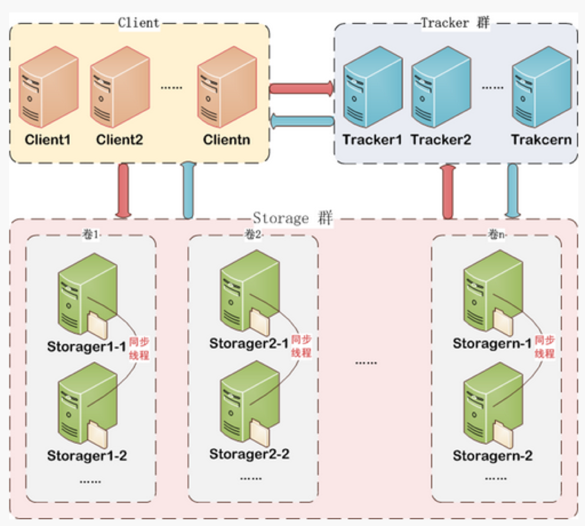

# FastDFS介绍

FastDFS是一个开源的高性能的分布式文件系统。主要功能包括：文件存储、文件同步和文件获取。

## FastDFS主要特点

- FastDFS是一个轻量级的开源分布式文件系统
- FastDFS主要解决了大容量的文件存储和高并发访问的问题，文件存取时实现了负载均衡
- FastDFS实现了软件方式的RAID，可以使用廉价的IDE硬盘进行存储
- 支持存储服务器在线扩容
- 支持相同内容的文件只保存一份，节约磁盘空间
- 组内冗余备份
- FastDFS只能通过Client API访问，不支持POSIX访问方式
- FastDFS特别适合大中型网站使用，用来存储资源文件（如：图片、文档、音频、视频等等）

## FastDFS与其他文件系统对比

|        指标        |  FastDFS   |                           TFS                            |          HDFS          |
| :----------------: | :--------: | :------------------------------------------------------: | :--------------------: |
|      适合类型      |  4KB-500M  | 所有文件，主要适用于海量小文件存储，通常文件大小不超过1M | 主要用于大数据计算存储 |
|     线性扩容性     |     高     |                            高                            |           高           |
| 文件高并发访问性能 |     高     |                            高                            |           高           |
|      硬件成本      |     低     |                            低                            |           高           |
|       复杂度       |    简单    |                           复杂                           |          简单          |
|      社区支持      | 国内用户群 |                            少                            |          较多          |
|      开发语言      |     C      |                           C++                            |          Java          |

## FastDFS架构原理

FastDFS总体架构由三个部分构成

- 客户端（Client）
- 访问服务器（TrackerServer）
- 存储服务器（StorageServer）



### 客户端（Client）

客户端指的是访问FastDFS分布式存储的客户端设备，通常是应用服务器。

### 访问服务器（TrackerServer）

TrackerServer是访问（或跟踪）服务器，是Client访问StorageServer的入口。

TrackerServer有以下两点重要作用：

- 【服务注册】管理StorageServer存储集群，StorageServer启动时，会把自己注册到TrackerServer上，并且定期报告自身状态信息，包括磁盘剩余空间、文件同步状况、文件上传下载次数等统计信息
- 【服务发现】Client访问StorageServer之前，必须先访问TrackerServer，动态获取到StorageServer的连接信息

为了保证高可用，一个FastDFS集群当中可以有多个TrackerServer节点，由集群自动选举一个leader节点。

### 存储服务器（StorageServer）

StorageServer是数据存储服务器，文件和描述信息(MetaData)都保存到存储服务器上。

- 可采用高可用的方式进行数据存储
- FastDFS集群当中StorageServer按组(Group/volume)提供服务，不同组的StorageServer之间不会相互通信，同组内的StorageServer之间会相互连接进行文件同步
- Storage server采用binlog文件记录文件上传、删除等更新操作。binlog中只记录文件名，不记录文件内容
- 文件同步只在同组内的Storage server之间进行，采用push方式，即源头服务器同步给目标服务器

> 说明：
>
> 1. 文件存储以后将返回唯一的“文件标识”，“文件标识”由"组名"和"文件名"两部分构成
> 2. MetaData是文件的描述信息，如 width=1024,heigth=768

## FastDFS文件上传原理

### 文件上传原理图


- client询问tracker可以上传到哪一个storage,或者指定获取**某个组**的storage
- tracker返回一台可用的storage
- client直接和storage通讯完成文件上传
- storage保存文件以后给client返回组名(volume)和文件名称

### 文件上传流程

#### 选择tracker

当集群中有多个tracker时，由于tracker之间是完全对等的关系，因此客户端在upload文件时可以任意选择一个trakcer

#### 选择group

当客户端没有指定group时，由服务端tracker自动指定。当tracker接收到upload file的请求时，会为该文件分配一个可以存储该文件的group，支持如下选择group的规则：

1. Round robin，所有的group间轮询
2. Specified group，指定某一个确定的group
3. Load balance，剩余存储空间多多group优先

#### 选择storage

当选定group后，tracker会在group内选择一个storage节点给客户端，支持如下选择storage的规则：

1. Round robin，在group内的所有storage间轮询
2. First server ordered by ip，按ip排序
3. First server ordered by priority，按优先级排序（优先级在storage上配置）

#### 选择storage path

当分配好storage server后，客户端将向storage发送写文件请求，storage将会为文件分配一个数据存储目录，支持如下规则：

1. Round robin，多个存储目录间轮询
2. 剩余存储空间最多的优先

#### 生成Fileid

选定存储目录之后，storage会为文件生一个Fileid:

1. storage server ip（32位整数）
2. 文件创建时间（unix时间戳，32位整数）
3. 文件大小
4. 文件crc32校验码
5. 随机数（这个字段用来避免文件重名）

Fileid由上述部分拼接而成，然后将这个二进制串进行base64编码，转换为可打印的字符串

#### 选择文件子目录

当选定存储目录之后，storage会为文件分配一个fileid，每个存储目录下有两级256*256的子目录，storage会按文件fileid进行两次hash，路由到其中一个子目录，然后将文件以fileid为文件名存储到该子目录下

#### 生成文件名返回客户端

当文件存储到某个子目录后，即认为该文件存储成功，接下来会为该文件生成一个文件名返回客户端，文件名由下述几个部分构成

1. group name-文件上传后所在的存储组名称
2. 存储目录 - 存储服务器配置的虚拟路径，与磁盘选项store_path*对应。如果配置了store_path0则是M00，如果配置了store_path1则是M01，以此类推
3. 数据两级目录 - 存储服务器在每个虚拟磁盘路径下创建的两级目录，用于存储数据文件
4. fileid
5. 文件后缀名（由客户端指定，主要用于区分文件类型）拼接而成

生成的文件名需返回到客户端，需要由客户端进行保存。

## FastDFS文件下载原理

### 文件下载原理图


1. client询问tracker下载文件的storage，参数为文件标识（组名和文件名）
2. tracker返回一台可用的storage
3. client直接和storage通讯完成文件下载

## FastDFS文件同步原理

1. 同一组内的StorageServer之间是对等的，文件上传、删除等操作可以在任意一台StorageServer上进行；
2. 文件同步(添加/删除/修改)只在同组内的StorageServer之间进行，采用push方式，即源服务器同步给目标服务器；
3. 源头数据才需要同步，备份数据不需要再次同步，否则就会构成环路了；
4. 上述第二条规则有个例外，就是新增加一台StorageServer时，由已有的一台StorageServer将已有的所有数据（包括源头数据和备份数据）同步给该新增服务器。

# FastDFS环境搭建

##分布式部署架构图


## 环境准备

### 使用的系统软件

| 名称                 | 说明                          |
| -------------------- | ----------------------------- |
| centos               | 7.6                           |
| libfatscommon        | FastDFS分离出的一些公用函数包 |
| FastDFS              | FastDFS本体                   |
| fastdfs-nginx-module | FastDFS和nginx的关联模块      |
| nginx                | nginx1.15.4                   |

### 编译环境

```shell
yum install git gcc gcc-c++ make automake autoconf libtool pcre pcre-devel zlib zlib-devel openssl-devel wget vim -y
```

### 磁盘目录

| 说明         | 位置           |
| ------------ | -------------- |
| 所有安装包   | /usr/local/src |
| 数据存储位置 | /egova/fastdfs |

```shell
# 创建数据存储目录
mkdir -p /egova/fastdfs/client
mkdir -p /egova/fastdfs/nginx
mkdir -p /egova/fastdfs/storage
mkdir -p /egova/fastdfs/tracker

# 查看数据存储位置目录树形结构
/egova/fastdfs
├── client	# 用于存放客户端数据
├── nginx		# 用于存放nginx日志
├── storage	# 用于存放存储服务器数据及日志信息
└── tracker	# 用于存放访问服务器数据和日志信息
```

## 安装

```shell
# 切换到安装目录准备下载安装包
cd /usr/local/src 
```

### 安装libfastcommon

```shell
git clone https://github.com/happyfish100/libfastcommon.git --depth 1
cd libfastcommon/
./make.sh && ./make.sh install #编译安装
```

### 安装FastDFS

```shell
cd ../ #返回上一级目录
git clone https://github.com/happyfish100/fastdfs.git --depth 1
cd fastdfs/
./make.sh && ./make.sh install #编译安装
#配置文件准备
cp /etc/fdfs/tracker.conf.sample /etc/fdfs/tracker.conf
cp /etc/fdfs/storage.conf.sample /etc/fdfs/storage.conf
cp /etc/fdfs/client.conf.sample /etc/fdfs/client.conf #客户端文件，测试用
cp /usr/local/src/fastdfs/conf/http.conf /etc/fdfs/ #供nginx访问使用
cp /usr/local/src/fastdfs/conf/mime.types /etc/fdfs/ #供nginx访问使用
```

### 安装fastdfs-nginx-module

```shell
cd ../ #返回上一级目录
git clone https://github.com/happyfish100/fastdfs-nginx-module.git --depth 1
cp /usr/local/src/fastdfs-nginx-module/src/mod_fastdfs.conf /etc/fdfs
```

### 安装nginx

```shell
wget http://nginx.org/download/nginx-1.15.4.tar.gz #下载nginx压缩包
tar -zxvf nginx-1.15.4.tar.gz #解压
cd nginx-1.15.4/
#添加fastdfs-nginx-module模块
./configure --add-module=/usr/local/src/fastdfs-nginx-module/src/ 
make && make install #编译安装
```

### 安装完成后的文件位置

```shell
# 相关配置文件
/etc/fdfs
├── client.conf
├── client.conf.sample
├── http.conf
├── mime.types
├── mod_fastdfs.conf
├── storage.conf
├── storage.conf.sample
├── storage_ids.conf.sample
├── tracker.conf
└── tracker.conf.sample
# 查看安装包所在位置目录树形结构
/usr/local/src
├── fastdfs
├── fastdfs-nginx-module
├── libfastcommon
├── nginx-1.15.4
```

## 配置

### 分布式部署

本地部署的四台服务器IP：

```shell
192.168.1.200
192.168.1.201
192.168.1.202
192.168.1.203
```

四台服务器均需进行以下配置/

### tracker配置

```shell
vim /etc/fdfs/tracker.conf
# 需要修改的内容如下
port=22122  # tracker服务器端口（默认22122,一般不修改）
base_path=/egova/fastdfs/tracker  # 存储日志和数据的根目录
```

### storage配置

```shell
vim /etc/fdfs/storage.conf
# 需要修改的内容如下
port=23000  # storage服务端口（默认23000,一般不修改）
base_path=/egova/fastdfs/storage  # 数据和日志文件存储根目录
store_path0=/egova/fastdfs/storage  # 第一个存储目录
tracker_server=192.168.1.200:22122  # 服务器1
tracker_server=192.168.1.201:22122  # 服务器2
tracker_server=192.168.1.202:22122  # 服务器3
tracker_server=192.168.1.203:22122  # 服务器3
http.server_port=8888  # http访问文件的端口(默认8888,看情况修改,和nginx中保持一致)
```

`192.168.1.200`和`192.168.1.201`服务器是一个组，`192.168.1.202`和`192.168.1.203`服务器是另一个组，组名需差异化设置，如下：

```shell
vim /etc/fdfs/storage.conf
# 需要修改的内容如下
## 192.168.1.200和192.168.1.201此处设置为 group1
group_name = group1
## 192.168.1.202和192.168.1.203此处设置为 group2
group_name = group2
```

### client配置

```shell
vim /etc/fdfs/client.conf
# 需要修改的内容如下
base_path=/egova/fastdfs/client
tracker_server=192.168.1.200:22122  # 服务器1
tracker_server=192.168.1.201:22122  # 服务器2
tracker_server=192.168.1.202:22122  # 服务器3
tracker_server=192.168.1.203:22122  # 服务器3
# 保存后测试,返回ID表示成功 如：group1/M00/00/00/xx.tar.gz
fdfs_upload_file /etc/fdfs/client.conf /usr/local/src/nginx-1.15.4.tar.gz
```

### 配置nginx访问

```shell
vim /etc/fdfs/mod_fastdfs.conf
# 需要修改的内容如下
tracker_server=192.168.1.200:22122  # 服务器1
tracker_server=192.168.1.201:22122  # 服务器2
tracker_server=192.168.1.202:22122  # 服务器3
tracker_server=192.168.1.203:22122  # 服务器3
url_have_group_name=true
store_path0=store_path0=/egova/fastdfs/storage
#配置nginx.config
vim /usr/local/nginx/conf/nginx.conf
## 开启访问日志
    log_format  main  '$remote_addr - $remote_user [$time_local] "$request" '
                      '$status $body_bytes_sent "$http_referer" '
                      '"$http_user_agent" "$http_x_forwarded_for"';

    access_log  /egova/fastdfs/nginx/logs/access.log  main;
## 添加如下配置
server {
    listen       8888;    ## 该端口为storage.conf中的http.server_port相同
    server_name  localhost;
    location ~/group[0-9]/ {
        ngx_fastdfs_module;
    }
    error_page   500 502 503 504  /50x.html;
    location = /50x.html {
    root   html;
    }
}
```

## 启动

### 防火墙相关设置

```shell
firewall-cmd --add-port=22122/tcp --permanent     ## 永久添加22122端口 (tracker服务器端口)
firewall-cmd --add-port=23000/tcp --permanent     ## 永久添加23000端口 (storage服务器端口)
firewall-cmd --reload                             ## 重启防火墙
```

### tracker

```shell
/etc/init.d/fdfs_trackerd start #启动tracker服务
/etc/init.d/fdfs_trackerd restart #重启动tracker服务
/etc/init.d/fdfs_trackerd stop #停止tracker服务
chkconfig fdfs_trackerd on #自启动tracker服务
```

### storage

```shell
/etc/init.d/fdfs_storaged start #启动storage服务
/etc/init.d/fdfs_storaged restart #重动storage服务
/etc/init.d/fdfs_storaged stop #停止动storage服务
chkconfig fdfs_storaged on #自启动storage服务
```

### nginx

```shell
/usr/local/nginx/sbin/nginx #启动nginx
/usr/local/nginx/sbin/nginx -s reload #重启nginx
/usr/local/nginx/sbin/nginx -s stop #停止nginx
```

### 上传文件测试


### 查看集群状态

```shell
[root@fastdfs-200 00]# /usr/bin/fdfs_monitor /etc/fdfs/storage.conf
[2020-03-08 03:14:55] DEBUG - base_path=/egova/fastdfs/storage, connect_timeout=5, network_timeout=60, tracker_server_count=4, anti_steal_token=0, anti_steal_secret_key length=0, use_connection_pool=1, g_connection_pool_max_idle_time=3600s, use_storage_id=0, storage server id count: 0

server_count=4, server_index=3

tracker server is 192.168.1.203:22122

group count: 2 # 组的个数

Group 1:
group name = group1
disk total space = 6,334 MB
disk free space = 4,877 MB
trunk free space = 0 MB
storage server count = 2
active server count = 2
storage server port = 23000
storage HTTP port = 8888
store path count = 1
subdir count per path = 256
current write server index = 0
current trunk file id = 0

	Storage 1:
		id = 192.168.1.200
		ip_addr = 192.168.1.200  ACTIVE
		http domain =
		version = 6.06
		join time = 2020-03-06 14:21:34
		up time = 2020-03-07 16:18:01
		total storage = 6,334 MB
		free storage = 4,877 MB
		upload priority = 10
		store_path_count = 1
		subdir_count_per_path = 256
		storage_port = 23000
		storage_http_port = 8888
		current_write_path = 0
		source storage id =
		if_trunk_server = 0
		connection.alloc_count = 256
		connection.current_count = 1
		connection.max_count = 6
		total_upload_count = 12
		success_upload_count = 12
		total_append_count = 0
		success_append_count = 0
		total_modify_count = 0
		success_modify_count = 0
		total_truncate_count = 0
		success_truncate_count = 0
		total_set_meta_count = 0
		success_set_meta_count = 0
		total_delete_count = 0
		success_delete_count = 0
		total_download_count = 8
		success_download_count = 8
		total_get_meta_count = 0
		success_get_meta_count = 0
		total_create_link_count = 0
		success_create_link_count = 0
		total_delete_link_count = 0
		success_delete_link_count = 0
		total_upload_bytes = 2657988
		success_upload_bytes = 2657988
		total_append_bytes = 0
		success_append_bytes = 0
		total_modify_bytes = 0
		success_modify_bytes = 0
		stotal_download_bytes = 2380646
		success_download_bytes = 2380646
		total_sync_in_bytes = 1860463
		success_sync_in_bytes = 1860463
		total_sync_out_bytes = 0
		success_sync_out_bytes = 0
		total_file_open_count = 29
		success_file_open_count = 29
		total_file_read_count = 12
		success_file_read_count = 12
		total_file_write_count = 25
		success_file_write_count = 25
		last_heart_beat_time = 2020-03-08 03:14:37
		last_source_update = 2020-03-08 00:15:51
		last_sync_update = 2020-03-07 23:53:59
		last_synced_timestamp = 2020-03-07 23:53:59 (0s delay)
	Storage 2:
		id = 192.168.1.201
		ip_addr = 192.168.1.201  ACTIVE
		http domain =
		version = 6.06
		join time = 2020-03-06 14:21:47
		up time = 2020-03-07 16:18:01
		total storage = 6,334 MB
		free storage = 4,878 MB
		upload priority = 10
		store_path_count = 1
		subdir_count_per_path = 256
		storage_port = 23000
		storage_http_port = 8888
		current_write_path = 0
		source storage id = 192.168.1.200
		if_trunk_server = 0
		connection.alloc_count = 256
		connection.current_count = 1
		connection.max_count = 6
		total_upload_count = 7
		success_upload_count = 7
		total_append_count = 0
		success_append_count = 0
		total_modify_count = 0
		success_modify_count = 0
		total_truncate_count = 0
		success_truncate_count = 0
		total_set_meta_count = 0
		success_set_meta_count = 0
		total_delete_count = 1
		success_delete_count = 1
		total_download_count = 2
		success_download_count = 2
		total_get_meta_count = 0
		success_get_meta_count = 0
		total_create_link_count = 0
		success_create_link_count = 0
		total_delete_link_count = 0
		success_delete_link_count = 0
		total_upload_bytes = 1505711
		success_upload_bytes = 1505711
		total_append_bytes = 0
		success_append_bytes = 0
		total_modify_bytes = 0
		success_modify_bytes = 0
		stotal_download_bytes = 354752
		success_download_bytes = 354752
		total_sync_in_bytes = 3190386
		success_sync_in_bytes = 3012740
		total_sync_out_bytes = 0
		success_sync_out_bytes = 0
		total_file_open_count = 23
		success_file_open_count = 23
		total_file_read_count = 2
		success_file_read_count = 2
		total_file_write_count = 25
		success_file_write_count = 25
		last_heart_beat_time = 2020-03-08 03:14:36
		last_source_update = 2020-03-07 23:53:59
		last_sync_update = 2020-03-08 00:15:52
		last_synced_timestamp = 2020-03-08 00:15:52 (0s delay)

Group 2:
group name = group2
disk total space = 6,334 MB
disk free space = 4,877 MB
trunk free space = 0 MB
storage server count = 2
active server count = 2
storage server port = 23000
storage HTTP port = 8888
store path count = 1
subdir count per path = 256
current write server index = 1
current trunk file id = 0

	Storage 1:
		id = 192.168.1.202
		ip_addr = 192.168.1.202  ACTIVE
		http domain =
		version = 6.06
		join time = 2020-03-06 14:21:48
		up time = 2020-03-07 16:18:01
		total storage = 6,334 MB
		free storage = 4,879 MB
		upload priority = 10
		store_path_count = 1
		subdir_count_per_path = 256
		storage_port = 23000
		storage_http_port = 8888
		current_write_path = 0
		source storage id =
		if_trunk_server = 0
		connection.alloc_count = 256
		connection.current_count = 1
		connection.max_count = 6
		total_upload_count = 10
		success_upload_count = 10
		total_append_count = 0
		success_append_count = 0
		total_modify_count = 0
		success_modify_count = 0
		total_truncate_count = 0
		success_truncate_count = 0
		total_set_meta_count = 0
		success_set_meta_count = 0
		total_delete_count = 1
		success_delete_count = 1
		total_download_count = 7
		success_download_count = 7
		total_get_meta_count = 0
		success_get_meta_count = 0
		total_create_link_count = 0
		success_create_link_count = 0
		total_delete_link_count = 0
		success_delete_link_count = 0
		total_upload_bytes = 3630694
		success_upload_bytes = 3630694
		total_append_bytes = 0
		success_append_bytes = 0
		total_modify_bytes = 0
		success_modify_bytes = 0
		stotal_download_bytes = 2251248
		success_download_bytes = 2251248
		total_sync_in_bytes = 1064256
		success_sync_in_bytes = 1064256
		total_sync_out_bytes = 0
		success_sync_out_bytes = 0
		total_file_open_count = 23
		success_file_open_count = 23
		total_file_read_count = 11
		success_file_read_count = 11
		total_file_write_count = 23
		success_file_write_count = 23
		last_heart_beat_time = 2020-03-08 03:14:38
		last_source_update = 2020-03-08 02:55:10
		last_sync_update = 2020-03-06 23:02:54
		last_synced_timestamp = 1970-01-01 08:00:00 (never synced)
	Storage 2:
		id = 192.168.1.203
		ip_addr = 192.168.1.203  ACTIVE
		http domain =
		version = 6.06
		join time = 2020-03-06 14:21:48
		up time = 2020-03-07 16:18:01
		total storage = 6,334 MB
		free storage = 4,877 MB
		upload priority = 10
		store_path_count = 1
		subdir_count_per_path = 256
		storage_port = 23000
		storage_http_port = 8888
		current_write_path = 0
		source storage id =
		if_trunk_server = 0
		connection.alloc_count = 256
		connection.current_count = 1
		connection.max_count = 6
		total_upload_count = 7
		success_upload_count = 7
		total_append_count = 0
		success_append_count = 0
		total_modify_count = 0
		success_modify_count = 0
		total_truncate_count = 0
		success_truncate_count = 0
		total_set_meta_count = 0
		success_set_meta_count = 0
		total_delete_count = 0
		success_delete_count = 0
		total_download_count = 4
		success_download_count = 4
		total_get_meta_count = 0
		success_get_meta_count = 0
		total_create_link_count = 0
		success_create_link_count = 0
		total_delete_link_count = 0
		success_delete_link_count = 0
		total_upload_bytes = 1241632
		success_upload_bytes = 1241632
		total_append_bytes = 0
		success_append_bytes = 0
		total_modify_bytes = 0
		success_modify_bytes = 0
		stotal_download_bytes = 974722
		success_download_bytes = 974722
		total_sync_in_bytes = 3630694
		success_sync_in_bytes = 3630694
		total_sync_out_bytes = 0
		success_sync_out_bytes = 0
		total_file_open_count = 21
		success_file_open_count = 21
		total_file_read_count = 5
		success_file_read_count = 5
		total_file_write_count = 24
		success_file_write_count = 24
		last_heart_beat_time = 2020-03-08 03:14:42
		last_source_update = 2020-03-06 23:02:53
		last_sync_update = 2020-03-08 02:55:11
		last_synced_timestamp = 2020-03-08 02:55:10 (0s delay)
```

# FastDFS监控系统

TODO：fastdfs-zyc

# 常见问题

1. 防火墙设置问题

报错信息：

```shell
[2020-03-07 09:17:18] ERROR - file: storage_ip_changed_dealer.c, line: 163, connect to tracker server 192.168.1.203:22122 fail, errno: 113, error info: No route to host
```

开放端口：

```shell
firewall-cmd --add-port=22122/tcp --permanent     ## 永久添加22122端口 
firewall-cmd --reload                             ## 重启防火墙
```

# 参考资料

- [FastDFS FAQ](http://bbs.chinaunix.net/thread-1920470-1-1.html)
- [FastDFS分布式文件系统概述](https://github.com/tobato/FastDFS_Client/wiki/01_overview)
- [用FastDFS一步步搭建文件管理系统](https://www.cnblogs.com/chiangchou/p/fastdfs.html)

