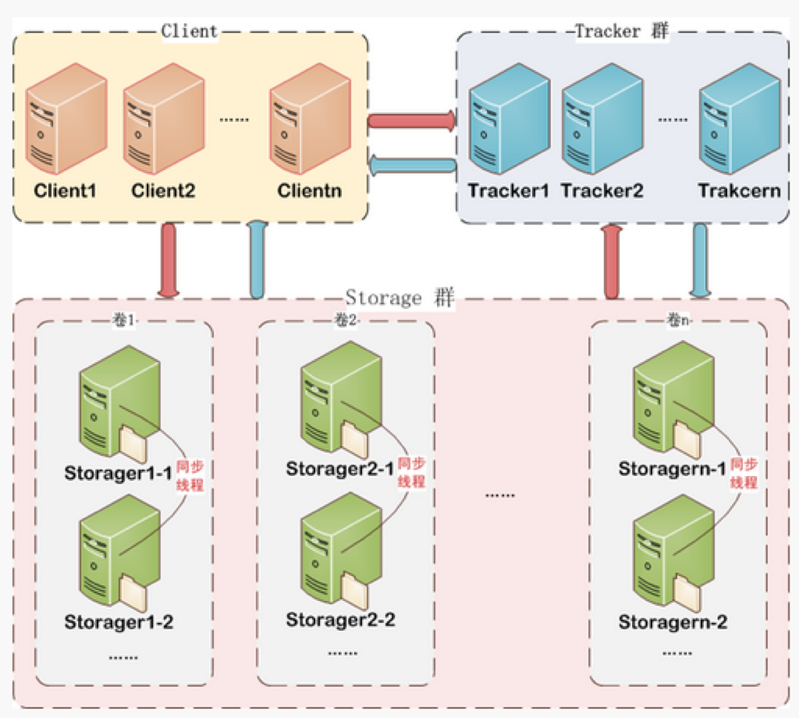
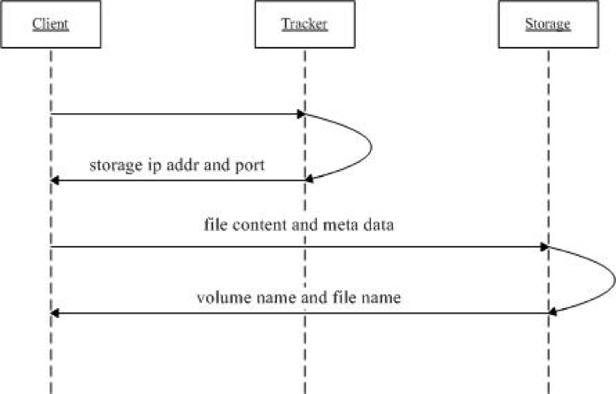
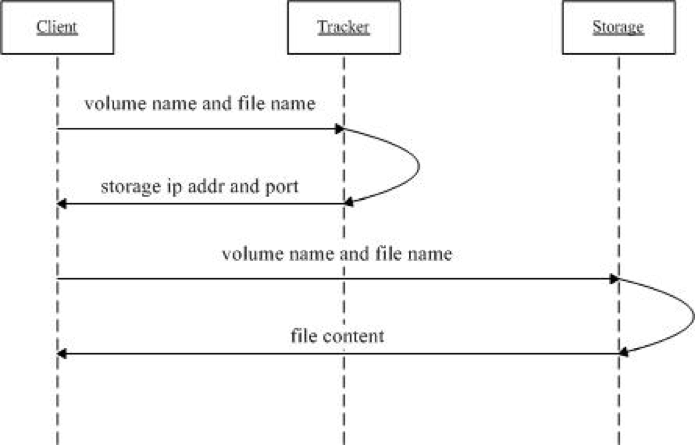

# FastDFS介绍

FastDFS是一个开源的高性能的分布式文件系统。主要功能包括：文件存储、文件同步和文件获取。

## FastDFS主要特点

- FastDFS是一个轻量级的开源分布式文件系统
- FastDFS主要解决了大容量的文件存储和高并发访问的问题，文件存取时实现了负载均衡
- FastDFS实现了软件方式的RAID，可以使用廉价的IDE硬盘进行存储
- 支持存储服务器在线扩容
- 支持相同内容的文件只保存一份，节约磁盘空间
- 组内冗余备份
- FastDFS只能通过Client API访问，不支持POSIX访问方式
- FastDFS特别适合大中型网站使用，用来存储资源文件（如：图片、文档、音频、视频等等）

## FastDFS与其他文件系统对比

|        指标        |  FastDFS   |                           TFS                            |          HDFS          |
| :----------------: | :--------: | :------------------------------------------------------: | :--------------------: |
|      适合类型      |  4KB-500M  | 所有文件，主要适用于海量小文件存储，通常文件大小不超过1M | 主要用于大数据计算存储 |
|     线性扩容性     |     高     |                            高                            |           高           |
| 文件高并发访问性能 |     高     |                            高                            |           高           |
|      硬件成本      |     低     |                            低                            |           高           |
|       复杂度       |    简单    |                           复杂                           |          简单          |
|      社区支持      | 国内用户群 |                            少                            |          较多          |
|      开发语言      |     C      |                           C++                            |          Java          |

## FastDFS架构原理

FastDFS总体架构由三个部分构成

- 客户端（Client）
- 访问服务器（TrackerServer）
- 存储服务器（StorageServer）

### 客户端（Client）

客户端指的是访问FastDFS分布式存储的客户端设备，通常是应用服务器。

### 访问服务器（TrackerServer）

TrackerServer是访问（或跟踪）服务器，是Client访问StorageServer的入口。

TrackerServer有以下两点重要作用：

- 【服务注册】管理StorageServer存储集群，StorageServer启动时，会把自己注册到TrackerServer上，并且定期报告自身状态信息，包括磁盘剩余空间、文件同步状况、文件上传下载次数等统计信息
- 【服务发现】Client访问StorageServer之前，必须先访问TrackerServer，动态获取到StorageServer的连接信息

为了保证高可用，一个FastDFS集群当中可以有多个TrackerServer节点，由集群自动选举一个leader节点。

###存储服务器（StorageServer）

StorageServer是数据存储服务器，文件和描述信息(MetaData)都保存到存储服务器上。

- 可采用高可用的方式进行数据存储
- FastDFS集群当中StorageServer按组(Group/volume)提供服务，不同组的StorageServer之间不会相互通信，同组内的StorageServer之间会相互连接进行文件同步
- Storage server采用binlog文件记录文件上传、删除等更新操作。binlog中只记录文件名，不记录文件内容
- 文件同步只在同组内的Storage server之间进行，采用push方式，即源头服务器同步给目标服务器

> 说明：
>
> 1. 文件存储以后将返回唯一的“文件标识”，“文件标识”由"组名"和"文件名"两部分构成
> 2. MetaData是文件的描述信息，如 width=1024,heigth=768

## FastDFS文件上传原理

### 文件上传原理图

- client询问tracker可以上传到哪一个storage,或者指定获取**某个组**的storage
- tracker返回一台可用的storage
- client直接和storage通讯完成文件上传
- storage保存文件以后给client返回组名(volume)和文件名称

### 文件上传流程

#### 选择tracker

当集群中有多个tracker时，由于tracker之间是完全对等的关系，因此客户端在upload文件时可以任意选择一个trakcer

#### 选择group

当客户端没有指定group时，由服务端tracker自动指定。当tracker接收到upload file的请求时，会为该文件分配一个可以存储该文件的group，支持如下选择group的规则：

1. Round robin，所有的group间轮询
2. Specified group，指定某一个确定的group
3. Load balance，剩余存储空间多多group优先

#### 选择storage

当选定group后，tracker会在group内选择一个storage节点给客户端，支持如下选择storage的规则：

1. Round robin，在group内的所有storage间轮询
2. First server ordered by ip，按ip排序
3. First server ordered by priority，按优先级排序（优先级在storage上配置）

#### 选择storage path

当分配好storage server后，客户端将向storage发送写文件请求，storage将会为文件分配一个数据存储目录，支持如下规则：

1. Round robin，多个存储目录间轮询
2. 剩余存储空间最多的优先

#### 生成Fileid

选定存储目录之后，storage会为文件生一个Fileid:

1. storage server ip（32位整数）
2. 文件创建时间（unix时间戳，32位整数）
3. 文件大小
4. 文件crc32校验码
5. 随机数（这个字段用来避免文件重名）

Fileid由上述部分拼接而成，然后将这个二进制串进行base64编码，转换为可打印的字符串

#### 选择文件子目录

当选定存储目录之后，storage会为文件分配一个fileid，每个存储目录下有两级256*256的子目录，storage会按文件fileid进行两次hash，路由到其中一个子目录，然后将文件以fileid为文件名存储到该子目录下

#### 生成文件名返回客户端

当文件存储到某个子目录后，即认为该文件存储成功，接下来会为该文件生成一个文件名返回客户端，文件名由下述几个部分构成

1. group name-文件上传后所在的存储组名称
2. 存储目录 - 存储服务器配置的虚拟路径，与磁盘选项store_path*对应。如果配置了store_path0则是M00，如果配置了store_path1则是M01，以此类推
3. 数据两级目录 - 存储服务器在每个虚拟磁盘路径下创建的两级目录，用于存储数据文件
4. fileid
5. 文件后缀名（由客户端指定，主要用于区分文件类型）拼接而成

生成的文件名需返回到客户端，需要由客户端进行保存。

## FastDFS文件下载原理

### 文件下载原理图

1. client询问tracker下载文件的storage，参数为文件标识（组名和文件名）
2. tracker返回一台可用的storage
3. client直接和storage通讯完成文件下载

## FastDFS文件同步原理

1. 同一组内的StorageServer之间是对等的，文件上传、删除等操作可以在任意一台StorageServer上进行；
2. 文件同步(添加/删除/修改)只在同组内的StorageServer之间进行，采用push方式，即源服务器同步给目标服务器；
3. 源头数据才需要同步，备份数据不需要再次同步，否则就会构成环路了；
4. 上述第二条规则有个例外，就是新增加一台StorageServer时，由已有的一台StorageServer将已有的所有数据（包括源头数据和备份数据）同步给该新增服务器。

# 参考资料

- [FastDFS FAQ](http://bbs.chinaunix.net/thread-1920470-1-1.html)
- [FastDFS分布式文件系统概述](https://github.com/tobato/FastDFS_Client/wiki/01_overview)
- [用FastDFS一步步搭建文件管理系统](https://www.cnblogs.com/chiangchou/p/fastdfs.html)

