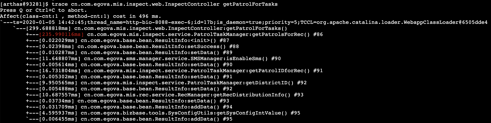
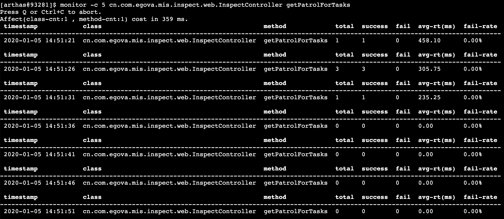

### 追踪一个方法的耗时情况

```shell
trace cn.com.egova.mis.inspect.web.InspectController getPatrolForTasks
```



### 统计方法耗时情况

每5秒统计一次getPatrolForTasks方法的耗时情况

```shell
monitor -c 5 cn.com.egova.mis.inspect.web.InspectController getPatrolForTasks
```

