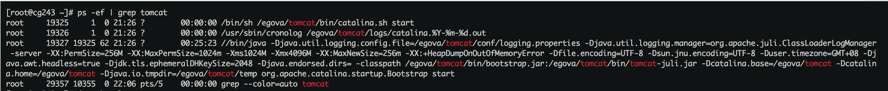
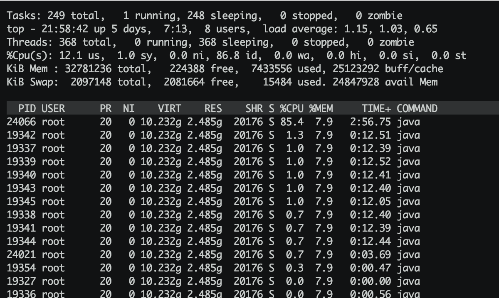
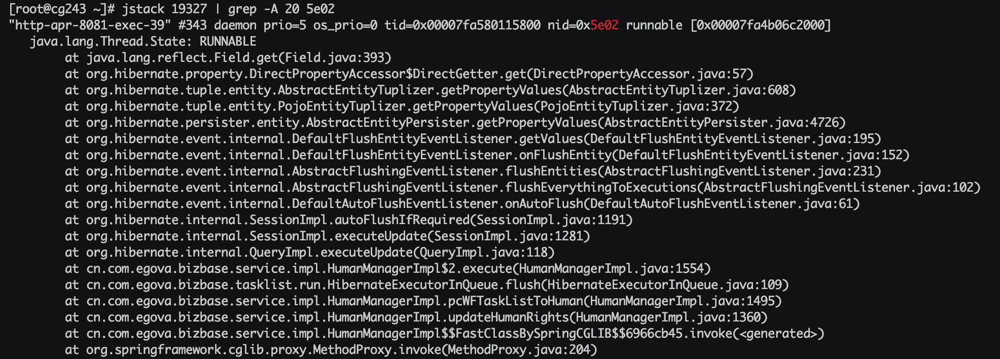

## 查看线程堆栈信息
### 使用场景

找出某个Java进程中最耗费CPU的Java线程并定位堆栈信息

- 先查找Java进程ID
  - 命令：`ps -ef | grep tomcat`
  - 得到进程ID为`19327`

- 找出该进程中最耗费CPU的线程
  - 命令：
    - `top -Hp 19327`
    - `ps -Lfp 19327`
    - `ps -mp 19327 -o THREAD, tid, time`
  - 得到最耗时的线程，其PID为`24066`
  - 得到最耗时线程PID对应的十六进制值：`printf "%x\n" 24066`，即：`5e02`

- 定位到最耗时CPU线程的堆栈信息
  - 命令：`jstack 19327 | grep 5e02`
  - 根据堆栈信息可定位到具体的代码位置

