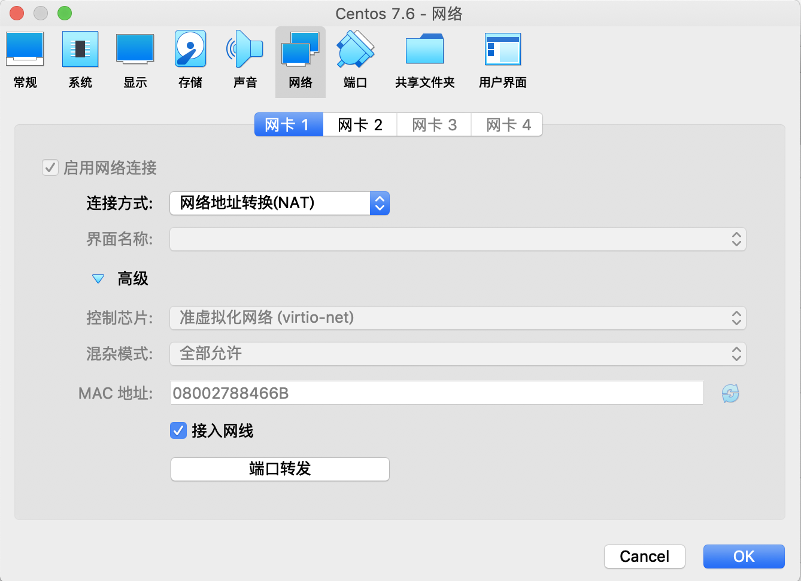
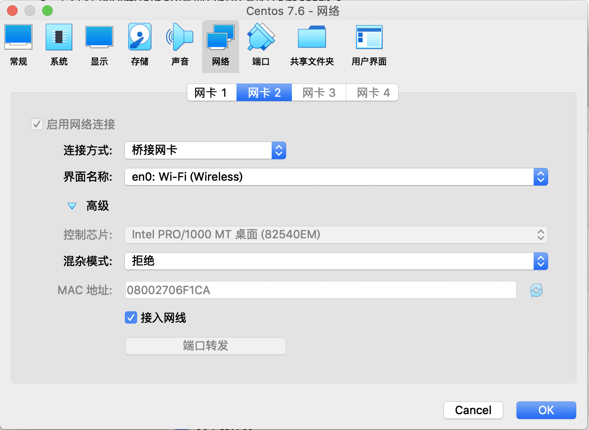

## Centos 安装问题

- Centos7最小化安装无ifconfig、netstat安装问题

```shell
yum -y install net-tools
```

- Xshell连接Centos

```shell
https://blog.csdn.net/elie_yang/article/details/81369136
```

- 无法访问virtualbox虚拟Linux上的Tomcat服务

```shell
http://www.voidcn.com/article/p-mijexelh-bnz.html
https://segmentfault.com/q/1010000004193816
```

## VirtualBox下的Centos安装与配置

- 网络配置





## CentOS 7 开放防火墙端口命令

```shell
// 临时关闭
systemctl stop firewalld
// 禁止开机启动
systemctl disable firewalld
firewall-cmd --state                           ##查看防火墙状态，是否是running
firewall-cmd --reload                          ##重新载入配置，比如添加规则之后，需要执行此命令
firewall-cmd --get-zones                       ##列出支持的zone
firewall-cmd --get-services                    ##列出支持的服务，在列表中的服务是放行的
firewall-cmd --query-service ftp               ##查看ftp服务是否支持，返回yes或者no
firewall-cmd --add-service=ftp                 ##临时开放ftp服务
firewall-cmd --add-service=ftp --permanent     ##永久开放ftp服务
firewall-cmd --remove-service=ftp --permanent  ##永久移除ftp服务
firewall-cmd --add-port=80/tcp --permanent     ##永久添加80端口 
iptables -L -n                                 ##查看规则，这个命令是和iptables的相同的
man firewall-cmd                               ##查看帮助
```

参考资料：https://blog.csdn.net/achang21/article/details/52538049

# 更换CentOS镜像

建议先备份 CentOS-Base.repo

```
sudo cp /etc/yum.repos.d/CentOS-Base.repo /etc/yum.repos.d/CentOS-Base.repo.bak
```

然后编辑 /etc/yum.repos.d/CentOS-Base.repo 文件，在 `mirrorlist=` 开头行前面加 `#` 注释掉；并将 `baseurl=` 开头行取消注释（如果被注释的话），把该行内的域名（例如`mirror.centos.org`）替换为 `mirrors.tuna.tsinghua.edu.cn`。

最后，更新软件包缓存

```
sudo yum makecache
```