```
扇区-->物理分区-->物理卷(pv)-->卷组(vg)-->逻辑卷(lv)-->文件系统
```

- 增加虚拟机可用磁盘空间

  【管理】-【虚拟介质管理器】

  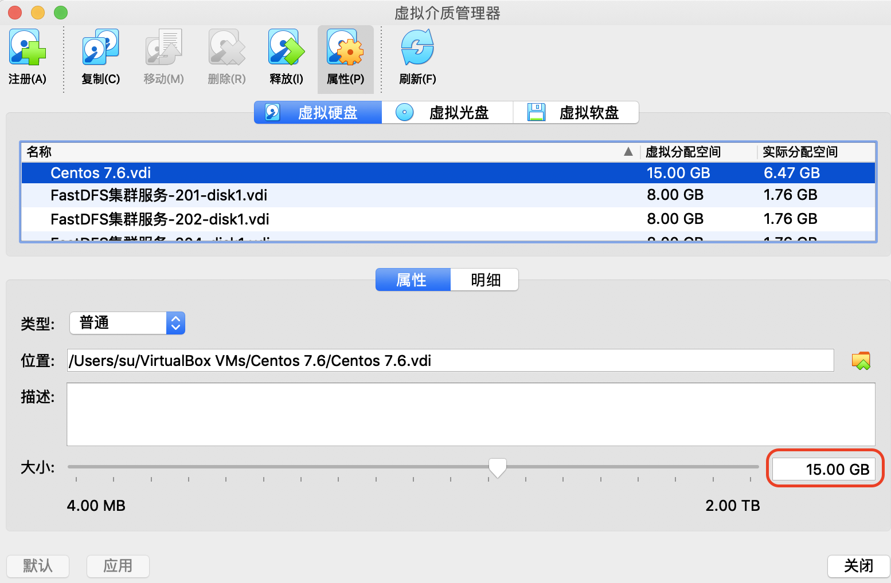

- 查看文件系统容量使用情况：`df -hl`

  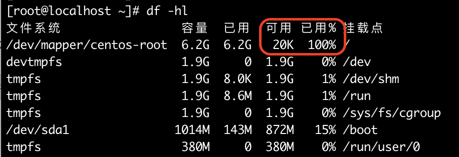

- 查看现有磁盘和分区情况：`fdisk -l`

  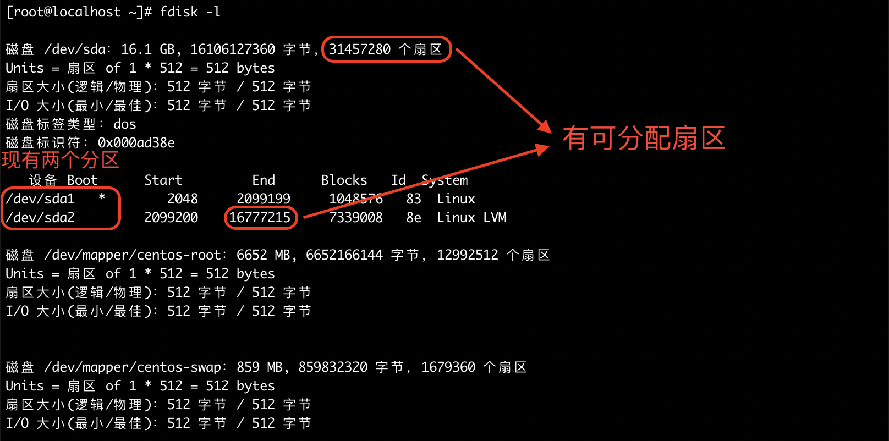

- 给sdk磁盘新建分区：`fdisk /dev/sda`

  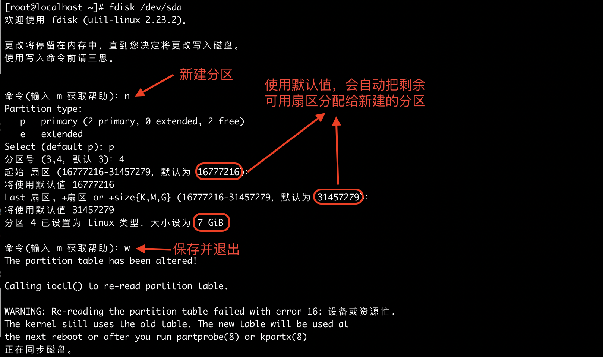

  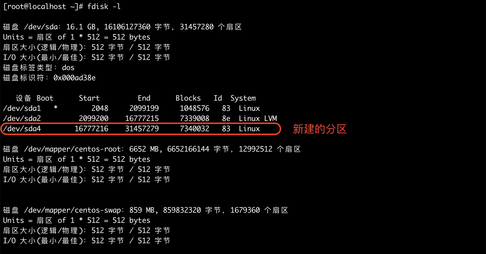

- 格式化新建的分区(格式化前需要先重启,命令reboot)：`mkfs.xfs /dev/sda4`

  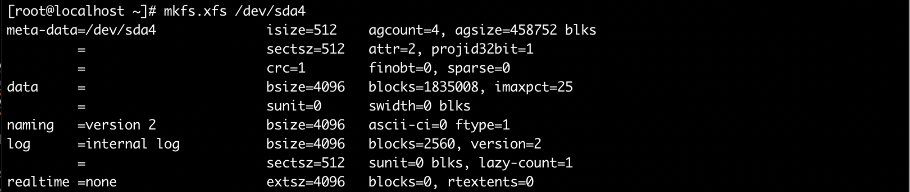

- 把新加的硬盘分区创建为物理卷

  查看命令：`pvdisplay`

  创建命令：`pvcreate /dev/sda4`

  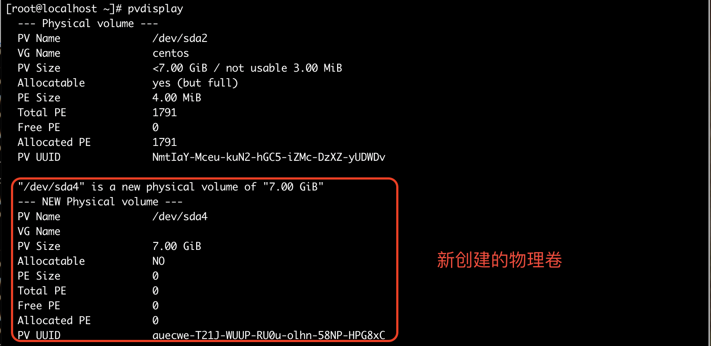

- 将新建的物理卷(pv)添加到卷组(vg)

  查看命令：`vgdisplay`

  扩展命令：`vgextend centos /dev/sda4`

  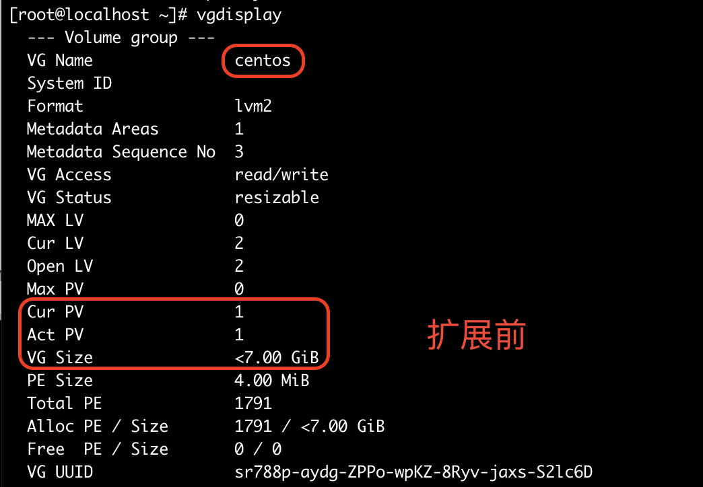

  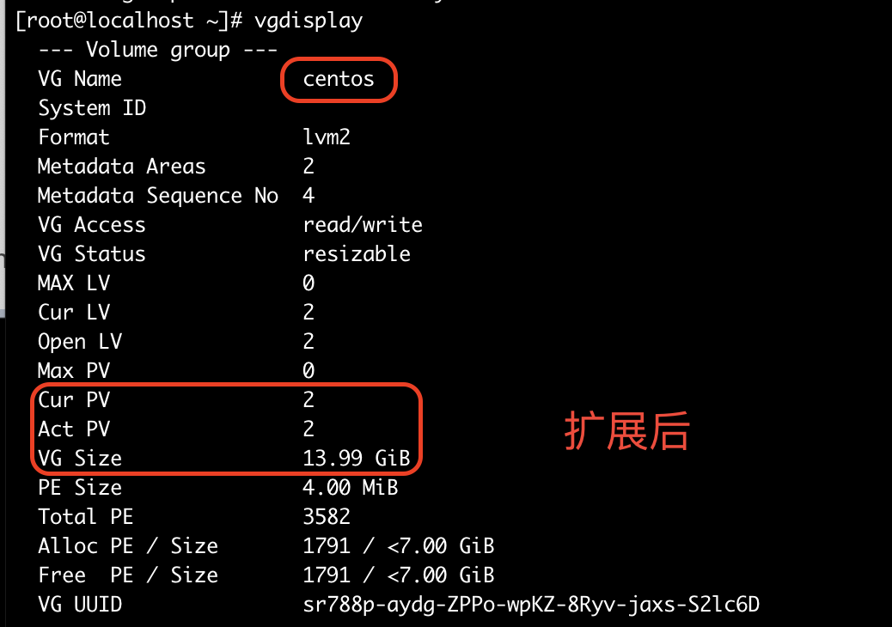

- 扩展逻辑卷(lv)

  查看命令：`lvdisplay`

  扩展命令：`lvextend -L +6G /dev/centos/root`

  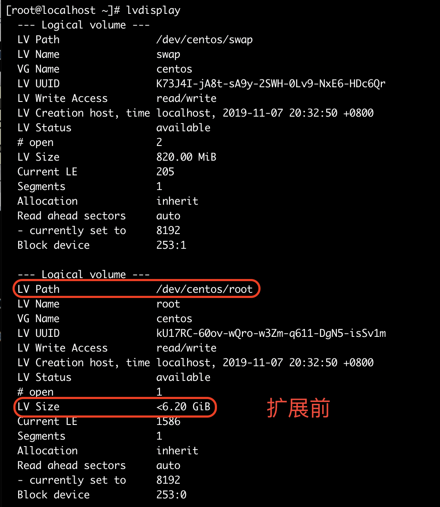

  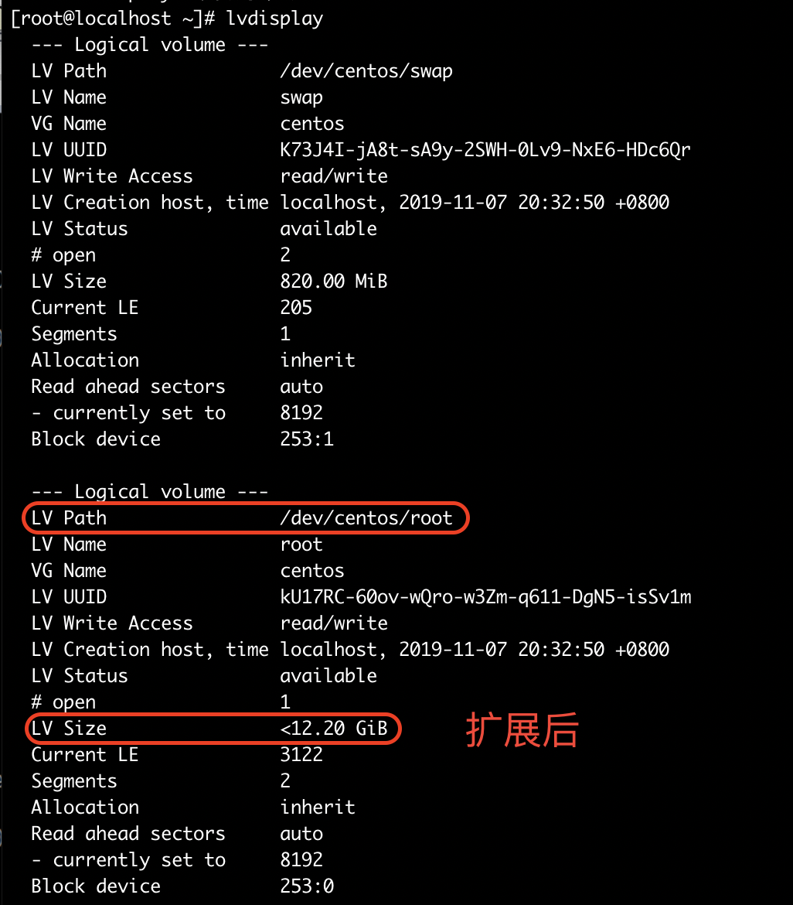

- 扩展文件系统

  查看命令：`df -hl`

  扩展命令：`xfs_growfs /dev/centos/root`

  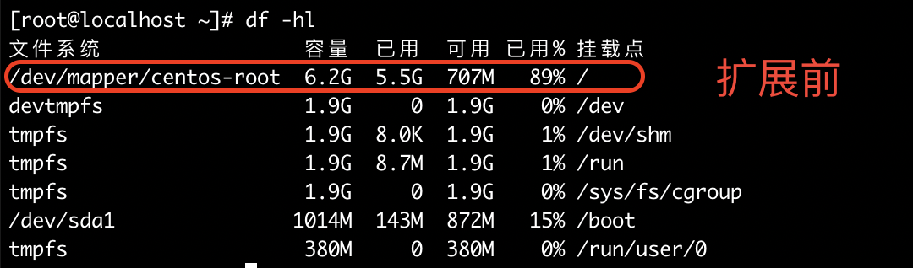

  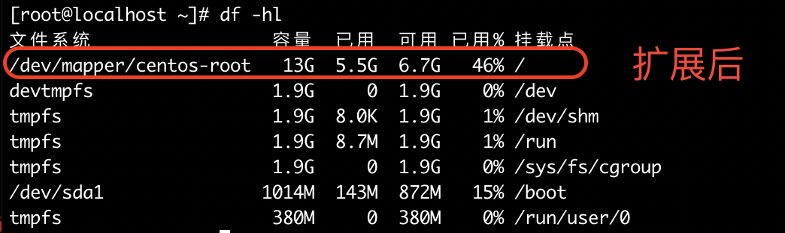

# 参考资料

- [VirtualBox上Centos7磁盘扩容](https://blog.csdn.net/haeydy/article/details/89447689)