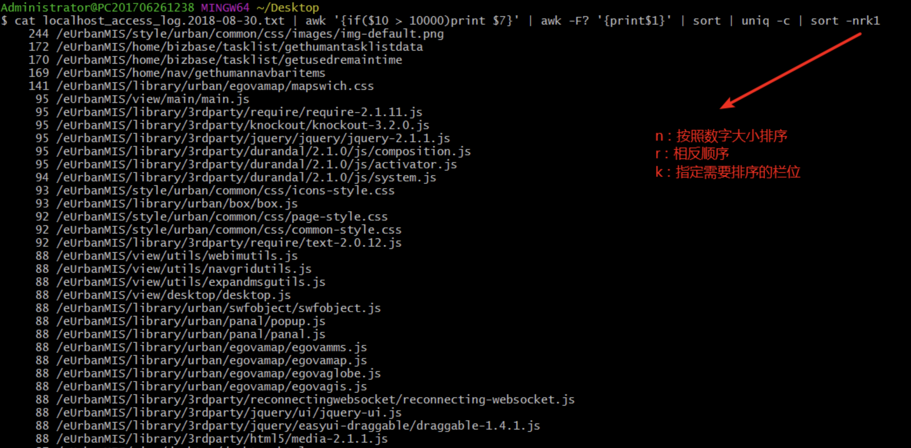
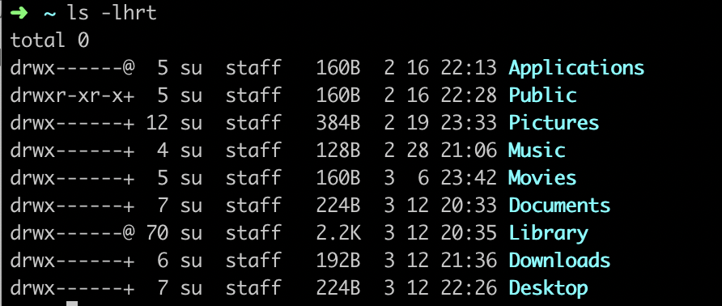

## 快速定位日志文件

- 命令

```shell
cat access.log | grep 02/Aug/2018:08 | grep -v -E 'IMserver|socket' | grep "  500 " | more
```

- 说明
  - 【命令】cat:常用来显示文件内容，或者将几个文件连接起来显示，或者从标准输入读取内容并显示
  - 【命令】grep:用于过滤搜索的特定字符
  - 【参数】more:命令和cat的功能一样都是查看文件里的内容，但有所不同的是more可以按页来查看文件的内容，还支持直接跳转行等功能

## 统计日志文件数据

- 命令

  ```shell
  cat localhost_access_log.2018-08-30.txt | awk '{if($10 > 10000)print $7}' | awk -F? '{print$1}' | sort | uniq -c | sort -nrk1
  ```

- 说明

  - 【命令】awk:一种编程语言，用于在linux/unix下对文本和数据进行处理
  - 【命令】uniq:用于报告或忽略文件中的重复行，一般与[sort](http://man.linuxde.net/sort)命令结合使用。
  - 【参数】F:指定输入分隔符
  - 【参数】c:在每列旁边显示该行重复出现的次数
  - 【参数】d:仅显示重复出现的行列



## 查看指定进程

- 命令

```shell
ps -ef | grep tomcat
```

- 说明
  - 【命令】ps:用于报告当前系统的进程状态
  - 【参数】e:显示所有程序
  - 【参数】f:显示UID,PPIP,C与STIME栏位


## 查询网络端口占用情况

### 方式一：lsof命令（推荐）

```shell
lsof -i:9000
```

> 通过list open file命令可以查看到当前打开文件，在linux中所有事物都是以文件形式存在，包括网络连接及硬件设备。


### 方式二：netstat命令

```shell
netstat -an | grep 9000
```


## 查看文件列表

- 命令

```shell
ls -lhrt
```

- 说明
  - 【命令】ls:用来显示目标列表
  - 【参数】l:所有输出信息以单列格式输出，默认为多列
  - 【参数】h:列出可读文件和文件夹详细信息
  - 【参数】r:以文件名反序排列并输出目录内容列表
  - 【参数】t:用文件和目录的更改时间排序



## 复制文件夹

- 命令

```shell
cp -r /usr/men/temp /home/men/temp
```

- 说明
  - 递归将某个文件夹复制到另一位置

## 文本搜索

- 命令

```shell
seq 10 | grep "5" -A 3
```

- 说明

  - 【参数】A:显示匹配某个结果之后的n行
  - 【参数】B:显示匹配某个结果之后的n行
  - 【参数】C:显示匹配某个结果之前和之后的n行


## 文件和文件夹大小排序

### 文件大小排序

- 命令

```shell
ls -Slrh
```

- 说明

  - 按文件大小排序

```shell
  $ ls -Slh
  total 5.4G
  -rw-r--r-- 1 Administrator 197121 2.8G 七月 11  2017 'Flash Builder.rar'
  -rwxr-xr-x 1 Administrator 197121 532M 七月  9  2018  ideaIU-2018.1.5.exe*
  -rw-r--r-- 1 Administrator 197121 420M 十月 10  2017 'IntelliJ IDEA.rar'
  -rwxr-xr-x 1 Administrator 197121 412M 十一 27  2017  wampserver3.1.0_x64.exe*
  -rwxr-xr-x 1 Administrator 197121 206M 十二  5  2017  jdk-8u151-windows-x64.exe*
  -rw-r--r-- 1 Administrator 197121 171M 十月 13  2017  flex_sdk_4.1.0.16076A.zip
  -rw-r--r-- 1 Administrator 197121 159M 十一 27  2017  PhpStorm-10.0.3.zip
```

### 文件夹大小排序

- 命令

```shell
du -s * | sort -nr
```

- 说明
  - 按文件夹大小排序

```shell
  $ du -s * | sort -nr
  2891858 Flash Builder
  2204748 Oracle Datebase 11g Release 2
  1151688 会声会影
  715521  win32_11gR2_client
  229696  Pandoc
  187129  WebStorm
  162389  PhpStorm-10.0.3
  149365  apache-tomcat-7.0.64
```

  

### awk拼接字符串

```shell
cat tcdutygrid.text | awk -F, '{print $1,$4,$5}' | sed 's/"//g' | awk -F" " '{print "INSERT INTO `46_kq_duty_grid`(`UnitID`, `DutyGridID`, `DutyGridName`, `DutyGridCode`) VALUES (9," $1",'\''"$2"'\'','\''"$3"'\'')"};'
```

