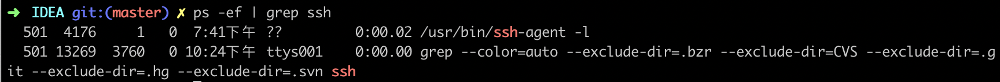
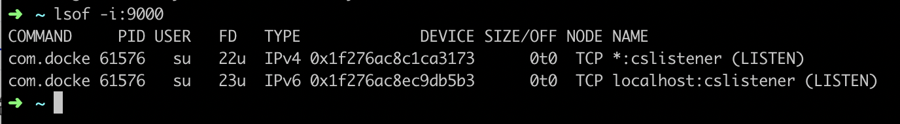
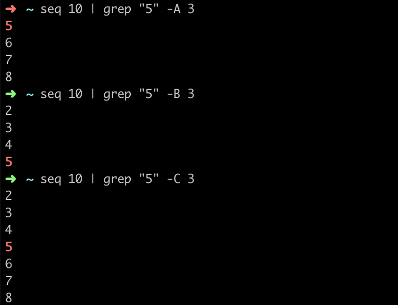

# 基本命令

## 查看用户登陆历史记录

```shell
[root@localhost ~]# last -x
root     pts/1        192.168.1.111    Wed Mar  4 08:05   still logged in
root     pts/0        192.168.1.102    Wed Mar  4 08:03   still logged in
```

功能说明：列出目前与过去登入系统的用户相关信息。

语 法：last [-adRx] [-f ] [-n ] [帐号名称…] [终端机编号…]

参 数：

- `a`：把从何处登入系统的主机名称或IP地址，显示在最后一行。

- `d` ：将IP地址转换成主机名称。

- `f` ：指定记录文件。

- `n` ：或- 设置列出名单的显示列数。

- `R` ：不显示登入系统的主机名称或IP地址。

- `x` ：显示系统关机，重新开机，以及执行等级的改变等信息。

# 问题排查常用命令

## 快速定位日志文件

- 命令

```shell
cat access.log | grep 02/Aug/2018:08 | grep -v -E 'IMserver|socket' | grep "  500 " | more
```

- 说明
  - 【命令】cat:常用来显示文件内容，或者将几个文件连接起来显示，或者从标准输入读取内容并显示
  - 【命令】grep:用于过滤搜索的特定字符
  - 【参数】more:命令和cat的功能一样都是查看文件里的内容，但有所不同的是more可以按页来查看文件的内容，还支持直接跳转行等功能

## 统计日志文件数据

- 命令

  ```shell
  cat localhost_access_log.2018-08-30.txt | awk '{if($10 > 10000)print $7}' | awk -F? '{print$1}' | sort | uniq -c | sort -nrk1
  ```

- 说明

  - 【命令】awk:一种编程语言，用于在linux/unix下对文本和数据进行处理
  - 【命令】uniq:用于报告或忽略文件中的重复行，一般与[sort](http://man.linuxde.net/sort)命令结合使用。
  - 【参数】F:指定输入分隔符
  - 【参数】c:在每列旁边显示该行重复出现的次数
  - 【参数】d:仅显示重复出现的行列


## 查看指定进程

- 命令

```shell
ps -ef | grep tomcat
```

- 说明
  - 【命令】ps:用于报告当前系统的进程状态
  - 【参数】e:显示所有程序
  - 【参数】f:显示UID,PPIP,C与STIME栏位



## 查询网络端口占用情况

### 方式一：lsof命令（推荐）

```shell
lsof -i:9000
```

> 通过list open file命令可以查看到当前打开文件，在linux中所有事物都是以文件形式存在，包括网络连接及硬件设备。



### 方式二：netstat命令

```shell
netstat -an | grep 9000
```


## 查看文件列表

- 命令

```shell
ls -lhrt
```

- 说明
  - 【命令】ls:用来显示目标列表
  - 【参数】l:所有输出信息以单列格式输出，默认为多列
  - 【参数】h:列出可读文件和文件夹详细信息
  - 【参数】r:以文件名反序排列并输出目录内容列表
  - 【参数】t:用文件和目录的更改时间排序


## 复制文件夹

- 命令

```shell
cp -r /usr/men/temp /home/men/temp
```

- 说明
  - 递归将某个文件夹复制到另一位置

## 文本搜索

- 命令

```shell
seq 10 | grep "5" -A 3
```

- 说明

  - 【参数】A:显示匹配某个结果之后的n行
  - 【参数】B:显示匹配某个结果之前的n行
  - 【参数】C:显示匹配某个结果之前和之后的n行



## 文件和文件夹大小排序

### 文件大小排序

- 命令

```shell
ls -Slrh
```

- 说明

  - 按文件大小排序

```shell
  $ ls -Slh
  total 5.4G
  -rw-r--r-- 1 Administrator 197121 2.8G 七月 11  2017 'Flash Builder.rar'
  -rwxr-xr-x 1 Administrator 197121 532M 七月  9  2018  ideaIU-2018.1.5.exe*
  -rw-r--r-- 1 Administrator 197121 420M 十月 10  2017 'IntelliJ IDEA.rar'
  -rwxr-xr-x 1 Administrator 197121 412M 十一 27  2017  wampserver3.1.0_x64.exe*
  -rwxr-xr-x 1 Administrator 197121 206M 十二  5  2017  jdk-8u151-windows-x64.exe*
  -rw-r--r-- 1 Administrator 197121 171M 十月 13  2017  flex_sdk_4.1.0.16076A.zip
  -rw-r--r-- 1 Administrator 197121 159M 十一 27  2017  PhpStorm-10.0.3.zip
```

### 文件夹大小排序

- 命令

```shell
du -s * | sort -nr
```

- 说明
  - 按文件夹大小排序

```shell
  $ du -s * | sort -nr
  2891858 Flash Builder
  2204748 Oracle Datebase 11g Release 2
  1151688 会声会影
  715521  win32_11gR2_client
  229696  Pandoc
  187129  WebStorm
  162389  PhpStorm-10.0.3
  149365  apache-tomcat-7.0.64
```

### awk拼接字符串

```shell
cat tcdutygrid.text | awk -F, '{print $1,$4,$5}' | sed 's/"//g' | awk -F" " '{print "INSERT INTO `46_kq_duty_grid`(`UnitID`, `DutyGridID`, `DutyGridName`, `DutyGridCode`) VALUES (9," $1",'\''"$2"'\'','\''"$3"'\'')"};'
```

### Linux上传文件和下载文件命令行方式

#### 通过lrzsz工具
- 安装lrzsz工具

```shell
yum install -y lrzsz
```

- 上传文件到Linux主机

```shell
rz
```

输入rz命令后，会弹出对话框，选择你要上传的文件，选择打开就上传到Linux主机。上传的文件在当前命令行的目录下

- 下载Linux文件

```shell
sz 文件名
```

#### 通过ssh传输文件

- 从服务器上下载文件到本地

```shell
scp username@servername:/path/filename /var/www/local_dir
```

- 上传本地文件到服务器

```shell
scp /path/filename username@servername:/path
```

- 从服务器下载整个目录

```shell
scp -r username@servername:/var/www/remote_dir/ /var/www/local_dir
```

- 上传目录到服务器

```shell
scp  -r local_dir username@servername:remote_dir
```


### 查看ip信息

- 方式1：`ip addr`

```shell
[root@localhost ~]# ip addr
1: lo: <LOOPBACK,UP,LOWER_UP> mtu 65536 qdisc noqueue state UNKNOWN group default qlen 1000
    link/loopback 00:00:00:00:00:00 brd 00:00:00:00:00:00
    inet 127.0.0.1/8 scope host lo
       valid_lft forever preferred_lft forever
    inet6 ::1/128 scope host 
       valid_lft forever preferred_lft forever
2: enp0s8: <BROADCAST,MULTICAST,UP,LOWER_UP> mtu 1500 qdisc pfifo_fast state UP group default qlen 1000
    link/ether 08:00:27:1e:48:60 brd ff:ff:ff:ff:ff:ff
    inet 192.168.1.105/24 brd 192.168.1.255 scope global noprefixroute dynamic enp0s8
       valid_lft 6740sec preferred_lft 6740sec
    inet6 fe80::87c1:f32f:15fe:5832/64 scope link tentative dadfailed 
       valid_lft forever preferred_lft forever
    inet6 fe80::4e36:23c4:2ef3:e3c8/64 scope link tentative dadfailed 
       valid_lft forever preferred_lft forever
    inet6 fe80::ddfd:833:d9e2:c2c9/64 scope link tentative dadfailed 
       valid_lft forever preferred_lft forever
3: eth0: <BROADCAST,MULTICAST,UP,LOWER_UP> mtu 1500 qdisc pfifo_fast state UP group default qlen 1000
    link/ether 08:00:27:cd:93:f5 brd ff:ff:ff:ff:ff:ff
    inet 10.0.2.15/24 brd 10.0.2.255 scope global noprefixroute dynamic eth0
       valid_lft 85941sec preferred_lft 85941sec
    inet6 fe80::fee0:b94d:39cc:9373/64 scope link noprefixroute 
       valid_lft forever preferred_lft forever
```

- 方式2：`ifconfig`（前提需安装net-tools）

```shell
[root@localhost ~]# ifconfig
enp0s8: flags=4163<UP,BROADCAST,RUNNING,MULTICAST>  mtu 1500
        inet 192.168.1.105  netmask 255.255.255.0  broadcast 192.168.1.255
        inet6 fe80::4e36:23c4:2ef3:e3c8  prefixlen 64  scopeid 0x20<link>
        inet6 fe80::ddfd:833:d9e2:c2c9  prefixlen 64  scopeid 0x20<link>
        inet6 fe80::87c1:f32f:15fe:5832  prefixlen 64  scopeid 0x20<link>
        ether 08:00:27:1e:48:60  txqueuelen 1000  (Ethernet)
        RX packets 26511  bytes 16039667 (15.2 MiB)
        RX errors 0  dropped 0  overruns 0  frame 0
        TX packets 17627  bytes 1933807 (1.8 MiB)
        TX errors 0  dropped 0 overruns 0  carrier 0  collisions 0

eth0: flags=4163<UP,BROADCAST,RUNNING,MULTICAST>  mtu 1500
        inet 10.0.2.15  netmask 255.255.255.0  broadcast 10.0.2.255
        inet6 fe80::fee0:b94d:39cc:9373  prefixlen 64  scopeid 0x20<link>
        ether 08:00:27:cd:93:f5  txqueuelen 1000  (Ethernet)
        RX packets 16  bytes 3059 (2.9 KiB)
        RX errors 0  dropped 0  overruns 0  frame 0
        TX packets 28  bytes 3492 (3.4 KiB)
        TX errors 0  dropped 0 overruns 0  carrier 0  collisions 0

lo: flags=73<UP,LOOPBACK,RUNNING>  mtu 65536
        inet 127.0.0.1  netmask 255.0.0.0
        inet6 ::1  prefixlen 128  scopeid 0x10<host>
        loop  txqueuelen 1000  (Local Loopback)
        RX packets 68  bytes 5896 (5.7 KiB)
        RX errors 0  dropped 0  overruns 0  frame 0
        TX packets 68  bytes 5896 (5.7 KiB)
        TX errors 0  dropped 0 overruns 0  carrier 0  collisions 0
```

## Shell内建命令

### 显示指定命令类型

- 命令

```shell
$ type -a grep
grep is /bin/grep
```

- 说明
  - 命令类型：file-文件、内部命令；alias-命令别名；builtin-内部命令
  - `-a`：在环境变量“PATH”指定的路径中，显示给定指令的信息，包括命令别名。

## Linux 查看磁盘空间

```shell
df -h
```

