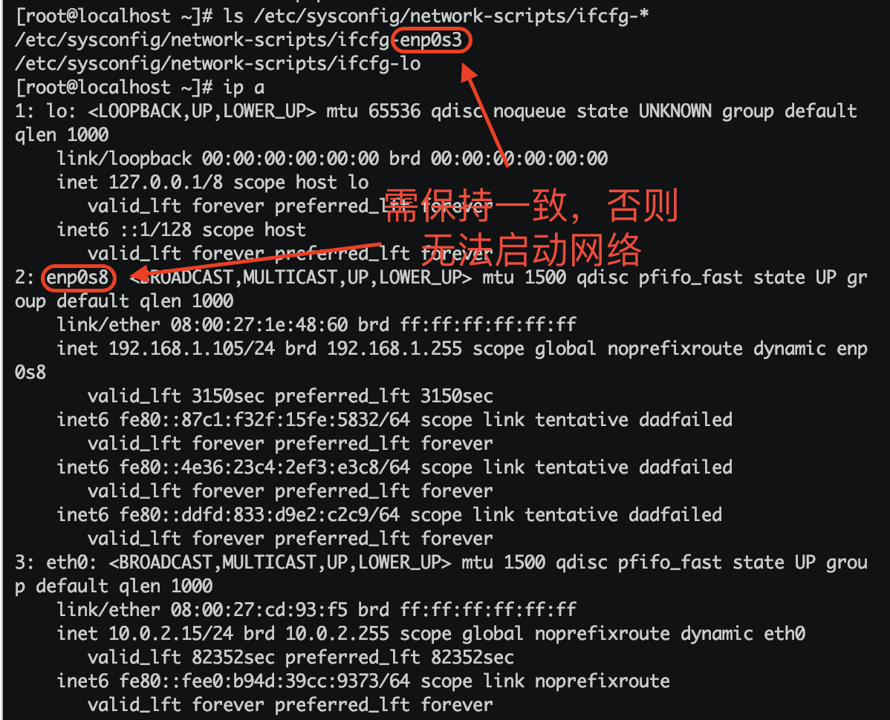

## 修改PATH环境变量

### 临时修改，关闭连接失效

```shell
export PATH=/usr/local/bin:$PATH
```

> 有效期限：临时改变，只能在当前的终端窗口中有效，当前窗口关闭后就会恢复原有的path配置
> 用户局限：仅对当前用户

### 永久修改当前用户

```shell
vim ~/.bashrc 
// 在最后一行添上：
export PATH=/usr/local/bin:$PATH
// 关闭保存，执行以下命令生效
source ~/.bashrc
```

> 有效期限：永久有效
> 用户局限：仅对当前用户

### 全局修改

```shell
vim /etc/profile
//在最后一行添上：
export PATH=/usr/local/bin:$PATH
// 关闭保存，执行以下命令生效
source ~/.bashrc
```

> 有效期限：永久有效
> 用户局限：对所有用户

## 设置静态IP

> 网络配置的配置文件在/etc/sysconfig/network-scripts/下，文件名前缀为ifcfg-后面跟的就是网卡的名称

- 先查看配置文件是否与网卡名一致

```shell
[root@localhost ~]# ls /etc/sysconfig/network-scripts/ifcfg-*
/etc/sysconfig/network-scripts/ifcfg-enp0s3
/etc/sysconfig/network-scripts/ifcfg-lo
```



- 若上述名称不一致，需调整配置文件名

```shell
[root@localhost network-scripts]# mv ifcfg-enp0s3 ifcfg-enp0s8
```

- 修改配置文件

```shell
TYPE=Ethernet
PROXY_METHOD=none
BROWSER_ONLY=no
BOOTPROTO=static # 改为 static
DEFROUTE=yes
IPV4_FAILURE_FATAL=no
IPV6INIT=yes
IPV6_AUTOCONF=yes
IPV6_DEFROUTE=yes
IPV6_FAILURE_FATAL=no
IPV6_ADDR_GEN_MODE=stable-privacy
NAME=enp0s8 # 改为实际网卡名称
UUID=b8adac9e-996d-4b3c-bd45-9176f4ac05d7
DEVICE=enp0s8 # 改为实际网卡名称
ONBOOT=yes    # 改为自启动
IPADDR=192.168.1.110  # 设置静态IP地址
NETMASK=255.255.255.0 # 子网掩码
GATEWAY=192.168.1.1   # 网关或路由地址
```

- 重启服务

```shell
service network restart
```

