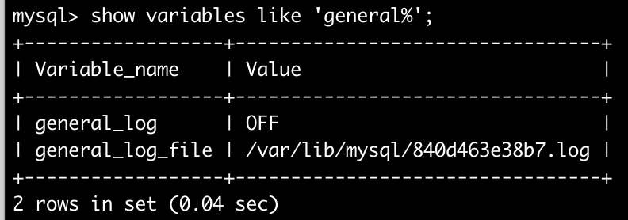
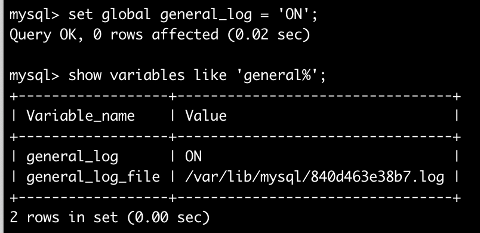

## 查用查询

```sql
-- 查看表索引
show index from tc_region;
show processlist;
explain select ...;
mysqlbinlog --base64-output=DECODE-ROWS --start-datetime='2018-07-29 15:50' --stop-datetime='2018-07-31 16:40' mysql-bin.000879|grep ALTER |more
-- 按日统计查询
select DATE_FORMAT(create_time,'%Y-%m-%d'), count(*) from to_rec 
where archive_cond_id = 0 group by DATE_FORMAT(create_time,'%Y-%m-%d');
```
## 查看表结构
```
-- 方法1
desc table;
-- 方法2
show columns from table;
```

## 查看记录数多的表
```
select table_name,table_rows from information_schema.tables 
where 1=1
order by table_rows desc;
```

## 查看数据库表占用空间情况
```sql
SELECT
	TABLE_NAME,
	CONCAT( ROUND( ( DATA_LENGTH + INDEX_LENGTH ) / 1024 / 1024, 2 ), 'MB' ),
	TABLE_ROWS 
FROM
	information_schema.TABLES 
WHERE
	TABLE_SCHEMA = '数据库名' 
ORDER BY
	DATA_LENGTH + INDEX_LENGTH DESC;
```
> 说明：
- TABLE_SCHEMA : 数据库名
- TABLE_NAME：表名
- ENGINE：所使用的存储引擎
- TABLES_ROWS：记录数
- DATA_LENGTH：数据大小
- INDEX_LENGTH：索引大小

## 查看表字段
```
select * from information_schema.columns where table_schema = 'cgdb' and table_name = 'to_his_rec'
and column_name not in (
select lower(column_name) from information_schema.columns where table_schema = 'cgdb' and table_name = 'to_rec')
```

## 查看指定字段类型信息

```mysql
select * from information_schema.columns where table_schema = 'cgdb0901' and column_type = 'geometry';
```

##将查询结果导出

- 先配置导入导出限制

  ```shell
  show global variables like '%secure_file_priv%';
  ```

  `secure_file_priv`参数用于限制`LOAD DATA, SELECT …OUTFILE, LOAD_FILE()`传到哪个指定目录。

  `secure_file_priv` 为 NULL 时，表示限制mysqld不允许导入或导出。
  `secure_file_priv `为 /tmp 时，表示限制mysqld只能在/tmp目录中执行导入导出，其他目录不能执行。
  `secure_file_priv` 没有值时，表示不限制mysqld在任意目录的导入导出

  因为`secure_file_priv`参数是只读参数，不能通过`set gloal`命令修改，只能在文件my.cnf中进行配置

  ```shell
  secure_file_priv=''
  ```

- 重启服务，并使用以下查询语句进行导出

  ```mysql
  select concat(c.value_name, "&", b.value_name, ',', a.c_event_desc) as text
  from szhcg_t_lh_um_event a left join szhcg_t_lh_um_event_code b on a.c_big_class_id = b.value_cd
  left join szhcg_t_lh_um_event_code c on a.c_small_class_id = c.value_cd 
  into outfile '/tmp/user.text';
  ```

## 查看及设置事物隔离级别

```mysql
## 针对mysql8
# 查看事物隔离级别
select @@transaction_isolation;
# 设置事物隔离级别
SET GLOBAL transaction_isolation='READ-COMMITTED';
```

## 查看及设置事物是否自动提交

```shell
# 查看状态
mysql> show variables like '%autocommit%';
+---------------+-------+
| Variable_name | Value |
+---------------+-------+
| autocommit    | OFF   |
+---------------+-------+
# 设置
set session autocommit=0;
```

## processlist使用详解

两种方式获取processlist信息

```mysql
# 第一种：使用show命令
show processlist;
# 第二种：查表
select * from information_schema.processlist;
```

两种方法获取到的信息基本相同，都包括这些属性：`ID`/`USER`/`HOST`/`DB`/`COMMAND`/`TIME`/`STATE`/`INFO`

具体值上稍有区别：`show processlist`的`Info`过长时会截取（100字符），且也不支持按属性过滤，不利于分析

一般可使用第二种查表方式进行过滤查看。

属性说明：

- `ID`：ID不难理解，就是mysql连接的唯一标识。该标识用途有两个：
  - 操作或过滤特定连接，比如使用`kill`命令时
  - 定位问题连接。比如查看事务、锁等时，其中都会有一个`thread_id`，这个就是对应的`processlist.ID`；通过这个关系，在分析复杂问题时可定位到具体连接

- `USER`：字面意思，创建数据库连接的用户。即可用于用户行为追踪，也可用于用户行为统计。
- `HOST`：创建连接的服务器，一般由服务器IP+端口组成；实际使用中，往往只有IP部分有用，比如按请求来源进行统计，使用时可以截取：`substring(host, 1, instr(host, ":")-1)`。
- `DB`：该连接执行SQL的数据库。
- `COMMAND`：连接状态。该项值常见的有Sleep(休眠)、Query(查询)、Connect(连接)，其他值一般也不常用
- `TIME`：连接的在当前状态(`STATE`)的持续时间，单位为秒。
- `STATE`：SQL执行的状态，要结合`TIME`来使用，即持续的时间比较长，则有问题的概率越大。
- `INFO`：正在执行的完整SQL语句

## 递归查询

```sql
select  unit_id, unit_name 
from    (select * from tc_unit
         order by senior_id, unit_id) units_sorted,
        (select @pv := '102169') initialisation
where   find_in_set(senior_id, @pv)
and     length(@pv := concat(@pv, ',', unit_id))
```

## 关于锁
```sql
1.查看下在锁的事务 
SELECT * FROM INFORMATION_SCHEMA.INNODB_TRX;
2.杀死进程id（就是上面命令的trx_mysql_thread_id列）
kill 线程ID

其它关于查看死锁的命令：
1：查看当前的事务
SELECT * FROM INFORMATION_SCHEMA.INNODB_TRX;
2：查看当前锁定的事务
SELECT * FROM INFORMATION_SCHEMA.INNODB_LOCKS;
3：查看当前等锁的事务
SELECT * FROM INFORMATION_SCHEMA.INNODB_LOCK_WAITS; 
```

## 解释（EXPLAIN）
### 命令格式
```
EXPLAIN SELECT * FROM table_name WHERE conditions \G;
```
### 示例
```
mysql> explain select * from to_rec where task_num = '201812070001' \G;
*************************** 1. row ***************************
           id: 1
  select_type: SIMPLE
        table: to_rec
   partitions: NULL
         type: ref
possible_keys: idx_rec_task_num
          key: idx_rec_task_num
      key_len: 123
          ref: const
         rows: 1
     filtered: 100.00
        Extra: NULL
1 row in set, 1 warning (0.00 sec)
```

---
# 准备
## 客户端连接 
* mysql -u root -p 回车输入密码
## 重要命令
* show variables <like "%%"> 
* show status <like "%%">
# 配置文件
* Linux位置 /etc/my.cnf
* Windows一般安装目录下 my.ini

# 检查配置
* log-bin=mysql-bin
* expire_logs_days=7
* binlog_format=row

* character-set-server=utf8
* skip-host-cache
* skip-name-resolve

* **max_connections=2000** #连接数
* wait_timeout=28800
* lower_case_table_names=1
* **innodb_buffer_pool_size=32G** # 内存分配
* **transaction-isolation**=READ-COMMITTED

* slow_query_log=on
* long_query_time=1
* binlog_cache_size=2M

* innodb_open_files=3000
* max_allowed_packet=1G
* open_files_limit=65535
* performance_schema=OFF
* tmp_table_size=256M
* max_heap_table_size=256M
* max_write_lock_count=102400
* thread_cache_size=100
* sort_buffer_size=4M
* key_buffer_size=32M
* read_buffer_size=4M
* join_buffer_size=8M
* innodb_flush_log_at_trx_commit=2
* innodb_log_file_size=1G
* innodb_buffer_pool_instances=8
* query_cache_size=0
* query_cache_type=0
* query_cache_limit=2M

* innodb_io_capacity=2000
* innodb_io_capacity_max=4000

# 日志分析
* [日志分割](http://note.youdao.com/noteshare?id=4d4f7552735b65df9f0fe3ec5564cadf)
* 慢日志
  * 开启 slow_query_log=on
  * 阈值 long_query_time=1 单位秒
  * 位置 slow_query_log_file=<path> 日志位置
  * 查看日志位置 show variables like "%slow%";
  * 热修改： set global long_query_time = 0.1;
  * mysqldumpslow 工具使用
    * 使用方法 ./mysqldumpslow -h 
    * 日志分割 logrotate 
* 全日志
  * set global general_log = on; 
  * 查看show variables like "%general_log_file%"
* binlog 日志
  * 用途：主从、实时监控数据变化、恢复数据
  * server-id=1     #id要唯一
  * log-bin=mysql-bin #开启binlog日志
  * expire_logs_days=7 # 只保留7天
  * binlog_format=row # 格式
  * 查看 
    * show binary logs;
    * show binlog events in 'mysql-bin.000001'; 
    * 用mysqlbinlog工具查看
> mysqlbinlog --start-datetime='2018-04-01 00:00:00' --stop-datetime='2016-05-01 23:01:01' -d cgdb /var/lib/mysql/mysql-bin.000001

* 错误日志
  * 查看show variables like "%log_error%"

- 日志记录查询/执行过的SQL语句

  - 查看日志功能是否开启：`show variables like 'general%';`

    

  - 开启日志功能：`set global general_log = 'ON';`

    


# 监控工具
## doDBA
* 项目地址 https://github.com/dblucyne/dodba_tools
* 使用直接看帮助 ./doDBA -help
* 配置 doDBA.conf
* 缺点：只能用在Linux上
* QPS:每秒查询次数 TPS:每秒提交事务次数


# 操作系统相关
* ulimit -a
* 学会修改操作系统打开文件数和打开进程数限制

# 常用技巧
## 紧急杀掉某个进程
> select * from information_schema.processlist  where state = "executing"；
> <br>
> 然后执行 kill id；

## 杀掉死锁线程
> SELECT trx_mysql_thread_id FROM information_schema.INNODB_TRX
> 是将查出的线程<br>
> kill trx_mysql_thread_id；

## 各个服务器连接数
> SELECT SUBSTRING_INDEX(HOST,':',1) AS host , COUNT(*) as count_ FROM information_schema.processlist GROUP BY ip order by count_ desc;

## 查询数据量最大的表
> select TABLE_ROWS,TABLE_NAME,TABLE_SCHEMA  from information_schema.TABLES where TABLE_SCHEMA = 'cgdb' order by TABLE_ROWS desc;

## 查看已连接数
> SHOW STATUS LIKE 'Threads_connected'; 

## 查看innodb状态（可查看最近一次死锁信息）
> show engine innodb status

## 查询锁信息
> SELECT * FROM INFORMATION_SCHEMA.INNODB_LOCKS; 

## 表分析
> Analyze Table <table_name><br>
> Optimize Table <table_name> <br>
> Optimize table 可能报错不可用，使用命令重启 service mysqld restart --skip-new

# FAQ

- 登陆数据库后，使用`use database`选择数据库很慢

  可在登陆数据库时带上参数`-A`不进行预读，提高选择数据库速度

  ```bash
  mysql -uroot -p -A
  ```

  