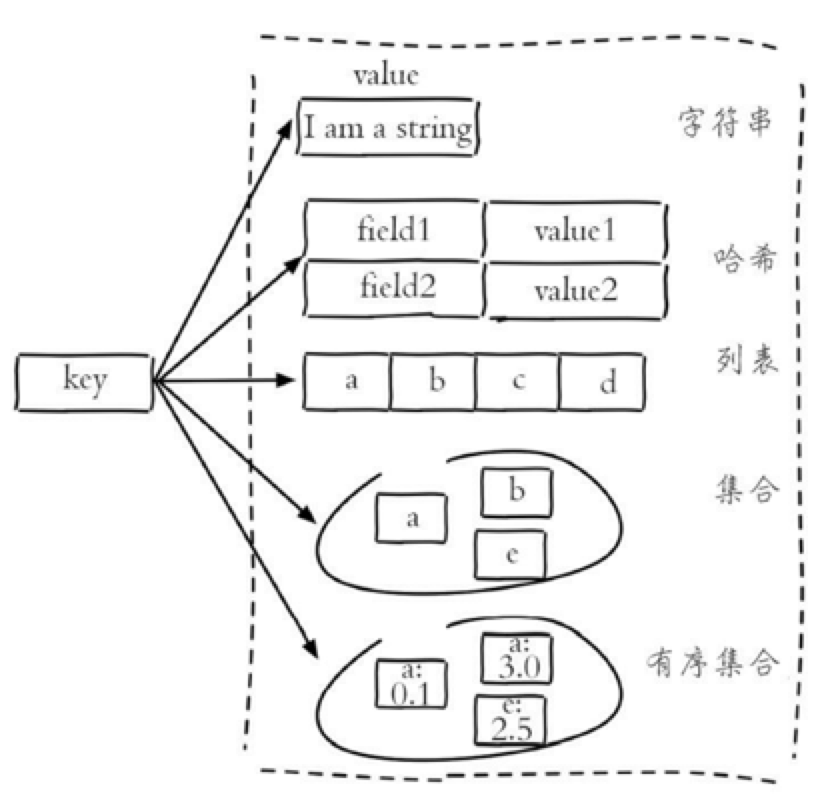

# Redis基础数据结构

Redis 有 5 种基础数据结构，分别为：string (字符串)、list (列表)、set (集合)、hash (哈希) 和 zset (有序集合)。



## string（字符串）

> 字符串 string 是Redis 最简单的数据结构。Redis 所有的数据结构都是以唯一的 key 字符串作为名称，然后通过这个唯一 key 值来获取相应的 value 数据。不同类型的数据结构的差异就在于 value 的结构不一样。字符串结构使用非常广泛，一个常见的用途就是缓存用户信息。我们将用户信息结构体使用 JSON 序列化成字符串，然后将序列化后的字符串塞进 Redis 来缓存。同样，取用户信息会经过一次反序列化的过程。

### 键值对

```shell
127.0.0.1:6379> set name redis
OK
127.0.0.1:6379> get name
"redis"
127.0.0.1:6379> del name
(integer) 1
127.0.0.1:6379> get name
(nil)
```

### 批量键值对

可以批量对多个字符串进行读写，节省网络耗时开销

```shell
127.0.0.1:6379> mset name1 Tom name2 Jack
OK
127.0.0.1:6379> mget name1 name2 name3
1) "Tom"
2) "Jack"
3) (nil)
```

### 过期和 set 命令扩展

可以对 key 设置过期时间，到点自动删除，这个功能常用来控制缓存的失效时间

- 通过`set`和`expire`设置过期

```shell
127.0.0.1:6379> set name Tom
OK
127.0.0.1:6379> get name
"Tom"
127.0.0.1:6379> expire name 5 # 设置 name 5秒后过期
(integer) 1
... # 等待5秒
127.0.0.1:6379> get name
(nil)
```

- **SETEX key seconds value**：设置过期时间

> 将键 `key` 的值设置为 `value` ， 并将键 `key` 的生存时间设置为 `seconds` 秒钟。
>
> 如果键 `key` 已经存在， 那么 `SETEX` 命令将覆盖已有的值。

```shell
127.0.0.1:6379> setex name 60 Tom # 设置 name 60秒后过期，等价于set + expire
OK
127.0.0.1:6379> get name
"Tom"
127.0.0.1:6379> ttl name # 剩余时间
(integer) 51
... # 等待N秒
127.0.0.1:6379> get name
(nil)
```

- **SETNX key value**

> 只在键 `key` 不存在的情况下， 将键 `key` 的值设置为 `value` 。
>
> 若键 `key` 已经存在， 则 `SETNX` 命令不做任何动作。
>
> `SETNX` 是『SET if Not eXists』(如果不存在，则 SET)的简写。

```shell
127.0.0.1:6379> setnx name Tom # 如果name不存在，则执行set命令创建
(integer) 1
127.0.0.1:6379> get name
"Tom"
127.0.0.1:6379> setnx name Jack # 如果name存在，则不做任何操作
(integer) 0
127.0.0.1:6379> get name
"Tom"
```

### 原子计数

- **INCR key**

> 为键 `key` 储存的数字值加上一。
>
> 如果键 `key` 不存在， 那么它的值会先被初始化为 `0` ， 然后再执行 `INCR` 命令。
>
> 如果键 `key` 储存的值不能被解释为数字， 那么 `INCR` 命令将返回一个错误。
>
> 本操作的值限制在 64 位(bit)有符号数字表示之内。

- **INCRBY key increment**

> 为键 `key` 储存的数字值加上增量 `increment` 。
>
> 如果键 `key` 不存在， 那么键 `key` 的值会先被初始化为 `0` ， 然后再执行 `INCRBY` 命令。
>
> 如果键 `key` 储存的值不能被解释为数字， 那么 `INCRBY` 命令将返回一个错误。
>
> 本操作的值限制在 64 位(bit)有符号数字表示之内。

```shell
127.0.0.1:6379> incr count
(integer) 1
127.0.0.1:6379> incr count
(integer) 2
127.0.0.1:6379> incr count
(integer) 3
127.0.0.1:6379> get count
"3"
127.0.0.1:6379> incrby count 5
(integer) 8
127.0.0.1:6379> get count
"8"

127.0.0.1:6379> set count 9223372036854775807 # Long.MAX
OK
127.0.0.1:6379> incr count
(error) ERR increment or decrement would overflow

```

同理，对应自减命令`DECR key`和`DECRBY key decrement`


##  list（列表）

> Redis 的列表相当于 Java 语言里面的 LinkedList，注意它是链表而不是数组。这意味着 list 的插入和删除操作非常快，时间复杂度为 O(1)，但是索引定位很慢，时间复杂度为 O(n)。 当列表弹出了最后一个元素之后，该数据结构自动被删除，内存被回收。
>
> Redis 的列表结构常用来做异步队列使用。将需要延后处理的任务结构体序列化成字符串塞进 Redis 的列表，另一个线程从这个列表中轮询数据进行处理。

### 右边进左边出（先进先出）：队列

```shell
127.0.0.1:6379> rpush books java python golang
(integer) 3
127.0.0.1:6379> llen books
(integer) 3
127.0.0.1:6379> lpop books
"java"
127.0.0.1:6379> lpop books
"python"
127.0.0.1:6379> lpop books
"golang"
127.0.0.1:6379> lpop books
(nil)
```

### 右边进右边出（先进后出）：栈

```shell
127.0.0.1:6379> rpush books java python golang
(integer) 3
127.0.0.1:6379> rpop books
"golang"
127.0.0.1:6379> rpop books
"python"
127.0.0.1:6379> rpop books
"java"
127.0.0.1:6379> rpop books
(nil)
```

## hash（哈希）

> Redis 的字典相当于 Java 语言里面的 HashMap，它是无序字典。内部实现结构上同 Java 的 HashMap 也是一致的，同样的数组 + 链表二维结构。第一维 hash 的数组位置碰撞时，就会将碰撞的元素使用链表串接起来。
>
> hash 结构也可以用来存储用户信息，不同于字符串一次性需要全部序列化整个对象，hash 可以对 用户结构中的每个字段单独存储。这样当我们需要获取用户信息时可以进行部分获取。而以整个字符串的形式去保存用户信息的话就只能一次性全部读取，这样就会比较浪费网络流量。 hash 也有缺点，hash 结构的存储消耗要高于单个字符串，到底该使用 hash 还是字符串，需要根据实际情况再三权衡。

```shell
127.0.0.1:6379> hset books java "think in java" # 设置值
(integer) 1
127.0.0.1:6379> hset books go "go in action"
(integer) 1
127.0.0.1:6379> hset books python "python cookbook"
(integer) 1

127.0.0.1:6379> hgetall books # 获取 books 下的所有key-value
1) "java"
2) "think in java"
3) "go"
4) "go in action"
5) "python"
6) "python cookbook"

127.0.0.1:6379> hlen books # 获取 books 下的键值对个数
(integer) 3
127.0.0.1:6379> hget books java
"think in java"
127.0.0.1:6379> hset books java "Efficient java"
(integer) 0
127.0.0.1:6379> hget books java
"Efficient java"

127.0.0.1:6379> hmset books java "think in java" go "go in action" python "python cookbook" # 批量set
OK
```

## set（集合）

> Redis 的集合相当于 Java 语言里面的 HashSet，它内部的键值对是无序的唯一的。它的内部实现相当于一个特殊的字典，字典中所有的 value 都是一个值NULL。 当集合中最后一个元素移除之后，数据结构自动删除，内存被回收。

```shell
127.0.0.1:6379> sadd books python
(integer) 1
127.0.0.1:6379> sadd books python # 若已存在，则返回0
(integer) 0
127.0.0.1:6379> sadd books java golang # 可批量添加
(integer) 2
127.0.0.1:6379> smembers books # 注意顺序，无序
1) "golang"
2) "python"
3) "java"
127.0.0.1:6379> sismember books java # 查询某个value是否存在，相当于contain(o)
(integer) 1
127.0.0.1:6379> sismember books ruby
(integer) 0
127.0.0.1:6379> scard books # 获取长度，相当于count()
(integer) 3
127.0.0.1:6379> spop books # 弹出一个，无顺序
"golang"
127.0.0.1:6379> spop books
"python"
127.0.0.1:6379> spop books
"java"
```

## zset（有序集合）

> zset 似于 Java 的 SortedSet 和 HashMap 的结合体，一方面它是一个 set，保证了内部 value 的唯一性，另一方面它可以给每个 value 赋予一个 score，代表这个 value 的排序权重。

zset 可以用来存粉丝列表，value 值是粉丝的用户 ID，score 是关注时间。我们可以对粉丝列表按关注时间进行排序。 

zset 还可以用来存储学生的成绩，value 值是学生的 ID，score 是他的考试成绩。我们可以对成绩按分数进行排序就可以得到他的名次。

```shell
127.0.0.1:6379> zadd books 9.0 java # 添加元素
(integer) 1
127.0.0.1:6379> zadd books 8.9 go
(integer) 1
127.0.0.1:6379> zadd books 8.5 python
(integer) 1
127.0.0.1:6379> zrange books 0 -1 # 按score顺序列出，参数为score范围
1) "python"
2) "go"
3) "java"
127.0.0.1:6379> zrevrange books 0 -1 # 按score逆序列出，参数score范围
1) "java"
2) "go"
3) "python"
127.0.0.1:6379> zcard books # 获取长度，相当于count()
(integer) 3
127.0.0.1:6379> zscore books java # 获取指定value的score
"9"
127.0.0.1:6379> zrank books java # 获取排名信息
(integer) 2
127.0.0.1:6379> zrank books go
(integer) 1
127.0.0.1:6379> zrank books python
(integer) 0
127.0.0.1:6379> zrangebyscore books 0 9 # 获取区间范围内value
1) "python"
2) "go"
3) "java"
127.0.0.1:6379> zrangebyscore books 0 8.9
1) "python"
2) "go"
127.0.0.1:6379> zrangebyscore books -inf 8.9 withscores # inf表示infinite
1) "python"
2) "8.5"
3) "go"
4) "8.9000000000000004"
127.0.0.1:6379> zrem books java # 删除指定value
(integer) 1
127.0.0.1:6379> zrange books 0 -1
1) "python"
2) "go"

```

# 常见知识点

## 为什么要用redis而不用map做缓存?

- Redis可以用几十G内存来做缓存，Map 不行，一般 JVM 也就分几个 G 数据就够大了
- Redis的缓存可以持久化，Map是内存对象，其生命周期随着jvm的销毁而结束
- Redis可以实现分布式的缓存，Map存在于其各自的实例中，不具有一致性
- Redis可以处理每秒百万级的并发，是专业的缓存服务，Map只是一个普通对象
- Redis缓存有过期机制，Map本身无此功能
- Redis有丰富的API，Map就简单太多


### 登陆验证

```shell
redis-cli -h 127.0.0.1 -p 6379 -a myPassword
```

