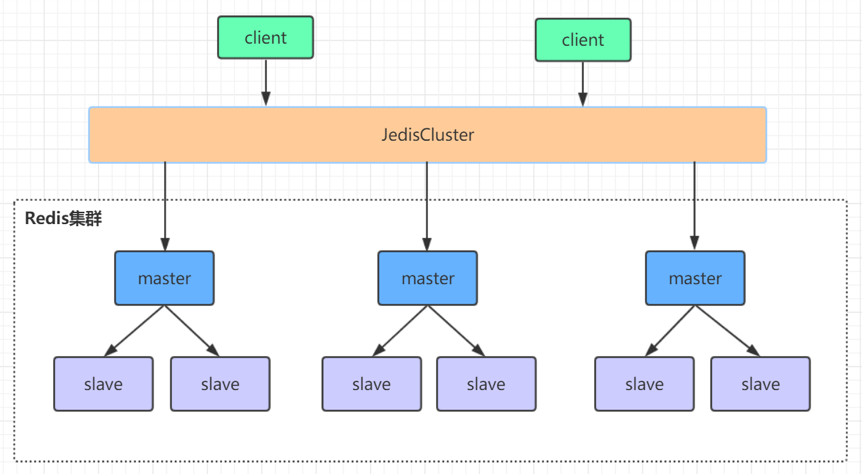
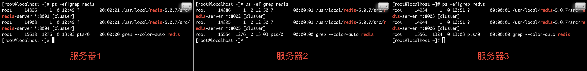

本文在Centos7.6环境下，以redis-5.0.7版本为例，搭建Redis高可用集群。

redis集群是一个由多个主从节点群组成的额分布式服务器群，它具有复制、高可用和分片特点。



# 安装Redis

下载redis（本文以redis-5.0.7为例）：

官网下载：http://www.redis.cn/download.html

github下载（推荐）：https://github.com/antirez/redis/archive/5.0.7.tar.gz

- 安装gcc

```shell
yum install gcc
```

- 将redis安装包解压至/usr/local文件下，并编译安装

```shell
tar zxf redis-5.0.7.tar.gz
cd redis-5.0.7
make
```

- 配置后台启动

将`/usr/local/redis-5.0.7/redis.conf`中的`daemonize`设置为`yes`

- 验证是否安装成功

```shell
# 启用并指定配置文件
/usr/local/redis-5.0.7/src/redis-server /usr/local/redis-5.0.7/redis.conf

# 验证是否启动成功
ps -ef|grep redis

# 进入redis客户端
/usr/local/redis-5.0.7/src/redis-cli

# 退出客户端并关闭redis服务
/usr/local/redis-5.0.7/src/redis-cli shutdown
```

# Redis集群搭建

本教程redis集群将搭建三个master节点，并给每个master节点再搭建一个slave节点，总共6个redis节点。使用三台centos服务部署6个redis实例，每台服务部署一主一从。

- 在第一台服务器上，搭建一主一从

```shell
# 在/usr/local下创建redis-cluster文件夹
mkdir -p /usr/local/redis-cluster

# 在redis-cluster下创建两个文件夹，用于存在主从redis配置
cd /usr/local/redis-cluster
mkdir 8001
mkdir 8004

# 配置redis.conf
# 1. 将/usr/local/redis-5.0.7/redis.conf配置文件拷贝至8001
cp /usr/local/redis-5.0.7/redis.conf /usr/local/redis-cluster/8001
# 2. 修改8001下的redis.conf
（1）damononize yes # 后台启动
（2）port 8001 # 设置redis端口
（3）dir /usr/local/redis-cluster/8001/ # 指定数据文件存在位置，必须要指定不同的目录位置，否则会丢失数据
（4）cluster-enabled yes # 启动集群模式
（5）cluster-config-file nodes-8001.conf # 集群节点信息文件
（6）cluster-node-timeout 5000 # 集群节点超时时限
（7）# bind 127.0.0.1 # 去掉bind绑定访问ip信息
（8）protected-mode no # 关闭保护模式
（9）appendonly yes # 开启aof

# 3. 将修改后的配置文件，拷贝一份至8004，并修改（2）（3）（5）里的端口号
:%s/源字符串/目标字符串/g
```

- 在另外两台服务器上，仿照第一台服务器，分别搭建一主一从

第二台服务器用8002和8005，第三台服务用8003和8006


- 分别启动6个redis实例

```shell
/usr/local/redis-5.0.7/src/redis-server /usr/local/redis-cluster/8001/redis.conf
```



- 用redis-cli创建整个redis集群(redis5以前的版本集群是依靠ruby脚本redistrib.rb实现)

```shell
/usr/local/redis-5.0.7/src/redis-cli --cluster create --cluster-replicas 1 192.168.1.110:8001 192.168.1.111:8002 192.168.1.112:8003 192.168.1.110:8004 192.168.1.111:8005 192.168.1.112:8006
```

# 验证集群

- 连接任意一个客户端

```shell
/usr/local/redis-5.0.7/src/redis-cli -c -h 192.168.1.110 -p 8001
```

> -c：表示集群模式
>
> -h：指定ip地址
>
> -p：指定端口号

- 查看集群信息和节点列表

集群信息：

```shell
192.168.1.110:8001> cluster info
cluster_state:ok
cluster_slots_assigned:16384
cluster_slots_ok:16384
cluster_slots_pfail:0
cluster_slots_fail:0
cluster_known_nodes:6
cluster_size:3
cluster_current_epoch:6
cluster_my_epoch:1
cluster_stats_messages_ping_sent:2321
cluster_stats_messages_pong_sent:2298
cluster_stats_messages_sent:4619
cluster_stats_messages_ping_received:2293
cluster_stats_messages_pong_received:2321
cluster_stats_messages_meet_received:5
cluster_stats_messages_received:4619
```

集群节点列表信息：

```shell
192.168.1.110:8001> cluster nodes
a7c58763628c7b9f7e967a5914e0764c75f76f43 192.168.1.110:8004@18004 slave 021a8e6f7fa0249cea861ecc164d0ab95356d340 0 1583290965191 4 connected
021a8e6f7fa0249cea861ecc164d0ab95356d340 192.168.1.112:8003@18003 master - 0 1583290965191 3 connected 10923-16383
7c6e587de355f000765a2d05d13edd928c57fb97 192.168.1.111:8002@18002 master - 0 1583290964586 2 connected 5461-10922
18cfbe5b9d28e26c571efdd7b35b44a08c5d7512 192.168.1.110:8001@18001 myself,master - 0 1583290964000 1 connected 0-5460
60678ffdced9b4076f5aa3d3c0f25ca92d7c503f 192.168.1.112:8006@18006 slave 7c6e587de355f000765a2d05d13edd928c57fb97 0 1583290964000 6 connected
da7e78bd427945c9e1b92355703593d129a58202 192.168.1.111:8005@18005 slave 18cfbe5b9d28e26c571efdd7b35b44a08c5d7512 0 1583290964183 5 connected
```

> 说明：节点列表中的每一行都代表集群中的一个节点。slave节点后的第四列哈希值表示其归属的master节点的哈希值。可以看出，为保障集群高可用，主从节点不在一个服务器上，从而避免一个服务挂了导致主从都不可用。

- 数据操作验证

```shell
192.168.1.110:8001> set name redis
-> Redirected to slot [5798] located at 192.168.1.111:8002
OK
192.168.1.111:8002> get name
"redis"
```

- 关闭集群（需逐个进行关闭）

```shell
/usr/local/redis-5.0.7/src/redis-cli -c -h 192.168.1.110 -p 8001 shutdown
```

# 参考资源

- [集群教程](http://redisdoc.com/topic/cluster-tutorial.html)