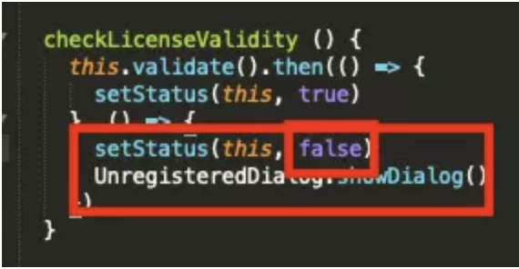

## 下载

官网下载：http://staruml.io/

## 破解

- 安装asar

  ```undefined
  sudo npm install -g asar
  ```

- 提取app.asar

  进入`Contents/Resources/`把app.asar复制出来

- 解压app.asar

  ```
  asar extract app.asar app
  ```

- 修改文件app/src/engine/license-manager.js

  找到`checkLicenseValidity`函数，将false改成true，并注释或删掉下面一行

  

- 重新打包

  ```
  asar pack app app.asar
  ```

- 将app.asar放回Contents/Resources/即可