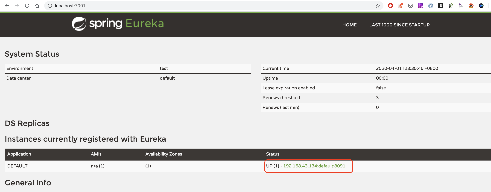
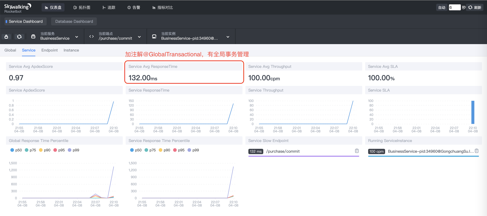
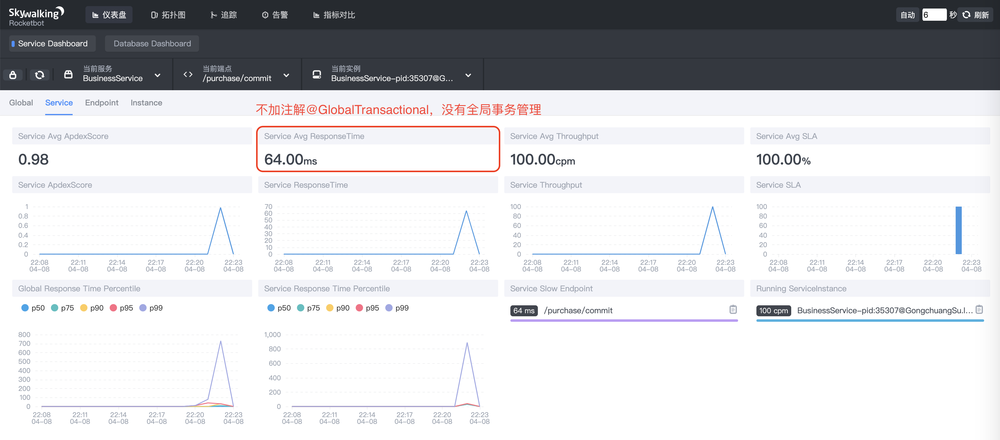

Seata分TC、TM和RM三个角色，TC（Server端）为单独服务端部署，TM和RM（Client端）由业务系统集成

# 基本信息

## 资源目录介绍

服务端和客户端的配置可参照以下资源，资源地址：[script](https://github.com/seata/seata/tree/develop/script)

参数配置说明，可查看：[seata参数配置 1.1.0版本](https://seata.io/zh-cn/docs/user/configurations.html)

- client

> 存放client端sql脚本，参数配置

- config-center

> 各个配置中心参数导入脚本，config.txt(包含server和client，原名nacos-config.txt)为通用参数文件

- server

> server端数据库脚本及各个容器配置

## 注解

- **@GlobalTransactional** ：注解在业务方法上用来开启全局事务，可以自定义超时时间、全局事务的名字、回滚时调用的类等。
- **@GlobalLock** ：声明事务仅执行在本地RM中，但是本次事务确保在更新状态下的操作记录不会被其他全局事务操作。即将本地事务的执行纳入seata分布式事务的管理，一起竞争全局锁，保证全局事务在执行的时候，本地业务不可以操作全局事务中的记录。
- **@EnableAutoDataSourceProxy**：自动代理数据源

# 部署
## 部署Seata Server

### 使用 Docker 部署 Seata Server

```shell
docker run --name seata-server -p 8091:8091 seataio/seata-server:latest
```

### 使用启动包

Server端存储模式（store.mode）现有file、db两种。file模式为单机模式，全局事务会话信息内存中读写并持久化本地文件root.data，性能较高；db模式为高可用模式，全局事务会话信息通过db共享，相应性能差些。

该教程采用file模式。

- 下载启动包：https://github.com/seata/seata/releases

- 配置`conf/registry.cnf`文件

  - 该配置文件用于指定 TC 的注册中心和配置文件，默认都是 file; 如果使用其他的注册中心，要求 Seata-Server 也注册到该配置中心上
  - 这里我们采用`eureka`注册中心，配置如下

  ```
    type = "eureka"
  
    eureka {
      serviceUrl = "http://127.0.0.1:7001/eureka"
      application = "default"
      weight = "1"
    }
  ```

- 其他文件默认配置即可
- 启动`./bin/seata-server.sh`

启动成功后，确认是否注册到eureka



## 业务系统集成Client

#### 步骤一：添加seata依赖

```xml
<dependency>
  <groupId>com.alibaba.cloud</groupId>
  <artifactId>spring-cloud-alibaba-seata</artifactId>
</dependency>
```

#### 步骤二：undo_log建表

在业务相关的数据库中添加 undo_log 表，用于保存需要回滚的数据

```sql
CREATE TABLE `undo_log`
(
    `id`            BIGINT(20)   NOT NULL AUTO_INCREMENT,
    `branch_id`     BIGINT(20)   NOT NULL,
    `xid`           VARCHAR(100) NOT NULL,
    `context`       VARCHAR(128) NOT NULL,
    `rollback_info` LONGBLOB     NOT NULL,
    `log_status`    INT(11)      NOT NULL,
    `log_created`   DATETIME     NOT NULL,
    `log_modified`  DATETIME     NOT NULL,
    `ext`           VARCHAR(100) DEFAULT NULL,
    PRIMARY KEY (`id`),
    UNIQUE KEY `ux_undo_log` (`xid`, `branch_id`)
) ENGINE = InnoDB
  AUTO_INCREMENT = 1
  DEFAULT CHARSET = utf8
```

#### 步骤三：服务中的Seata配置
##### 方式1：添加Seata 配置文件至当前服务resources目录下

**registry.conf**

- 该配置用于指定 TC 的注册中心和配置文件，默认都是 file; 如果使用其他的注册中心，要求 Seata-Server 也注册到该配置中心上

- 这里我们采用`eureka`注册中心，配置如下

  ```
    type = "eureka"
  
    eureka {
      serviceUrl = "http://127.0.0.1:7001/eureka"
      application = "default"
      weight = "1"
    }
  ```

**file.conf**

- 该配置用于指定TC的相关属性；如果使用注册中心也可以将配置添加到配置中心

- 配置事务分组，拿多媒体服务为例，配置如下：（事务分组相关可查看[事务分组专题](https://seata.io/zh-cn/docs/user/transaction-group.html)）

  ```
  service.vgroupMapping.egova-service-media-fescar-service-group = "default"
  ```

  注意：`application.yml`里的`spring.cloud.alibaba.seata.tx-service-group: egova-service-media-fescar-service-group`需设置成一致

##### 方式2：配置application.yml（推荐）

```yml
# ===================================================================
# Seata 配置
# ===================================================================
seata:
  enabled: true
  application-id: ${spring.application.name}
  service:
    vgroup-mapping:
      seata-demo-service-fescar-service-group: default
    grouplist:
      default: 127.0.0.1:8091
    # 全局事务开关
    disable-global-transaction: false
  registry:
    type: eureka
    eureka:
      weight: 1
      service-url: ${EUREKA_URL:http://eureka7001:7001/eureka/}
  config:
    type: file
```

> 说明：
> seata.tx-service-group=自定分组名
> seata.service.vgroup-mapping.自定分组名=服务端注册中心配置的cluster的值

#### 步骤四：数据源代理(不支持自动和手动配置并存)

Seata 通过代理数据源的方式实现分支事务，若没有配置，则回滚将不起作用。

- 0.9.0版本开始seata支持自动代理数据源

  ```
  1.1.0: 取消属性配置，改由注解@EnableAutoDataSourceProxy开启，并可选择jdk proxy或者cglib proxy
  1.0.0: client.support.spring.datasource.autoproxy=true
  0.9.0: support.spring.datasource.autoproxy=true
  ```

- 手动配置

  ```java
  @Configuration
  public class DataSourceProxyConfig {
  
      @Bean
      @ConfigurationProperties(prefix = "spring.datasource")
      public DruidDataSource druidDataSource() {
          return new DruidDataSource();
      }
  
      @Primary
      @Bean
      public DataSourceProxy dataSource(DruidDataSource druidDataSource) {
          return new DataSourceProxy(druidDataSource);
      }
  
  }
  ```

> TBD：项目中使用@EnableAutoDataSourceProxy注解自动开启代理数据源时，结果并没有生效，有待深入研究，目前使用手动配置

#### 步骤五：使用`@GlobalTransactional`开启事务

在业务的发起方的方法上使用`@GlobalTransactional`开启全局事务，Seata 会将事务的 xid 通过拦截器添加到调用其他服务的请求中，实现分布式事务

# Seata能与不能

**Seata 无法保证哪些场景的数据一致性**

1. 数据源、业务册全部节点（当前全部和无新节点）的不可恢复性故障

2. Seata-Server存储故障
3. 活动中事务的二阶段Seata-Server与业务侧永不可达

**Seata 能保证哪些极端情况下的数据一致性**

1. 服务调用timeout
2. 被调用服务宕机，网络问题等服务不可达或可恢复性重试情况
3. 当业务服务出现不可恢复性部分宕机或者可恢复性全部节点宕机情况
4. Seata-Server不可恢复性部分或全部计算节点宕机

# FAQ

- 需要注意的是 `service.vgroup_mapping`这个配置，在 Spring Cloud 中默认是`${spring.application.name}-fescar-service-group`，可以通过指定`application.properties`的 `spring.cloud.alibaba.seata.tx-service-group`这个属性覆盖，但是必须要和 `file.conf `中的一致，否则会提示 `no available server to connect`

  ```java
  2020-04-01 20:48:57.887  WARN 17366 --- [nfigOperate_1_2] io.seata.config.FileConfiguration        : Could not found property service.vgroup_mapping.egova-service-media-fescar-service-group, try to use default value instead.
  2020-04-01 20:48:57.887 ERROR 17366 --- [imeoutChecker_1] i.s.c.r.netty.NettyClientChannelManager  : no available server to connect.
  ```

- 报错`no available service 'null' found, please make sure registry config correct`

  **原因：**需指定事务分组，且名称需保持一致

  - `file.conf`：service.vgroupMapping.**egova-service-media-fescar-service-group** = "default"

  - `application.yml`：

    ```
    spring:
      cloud:
        alibaba:
          seata:
            tx-service-group: egova-service-media-fescar-service-group
    ```

- 数据源依赖问题

  ```
  The dependencies of some of the beans in the application context form a cycle:
  
     objectMapperConfigurer defined in class path resource [springfox/documentation/spring/web/SpringfoxWebMvcConfiguration.class]
        ↓
     transactionAdviceConfig (field private org.springframework.transaction.PlatformTransactionManager cn.com.egova.base.config.TransactionAdviceConfig.transactionManager)
        ↓
     org.springframework.boot.autoconfigure.orm.jpa.HibernateJpaConfiguration
  ┌─────┐
  |  dataSource defined in class path resource [cn/com/egova/config/DataSourceConfig.class]
  ↑     ↓
  |  druidDataSource defined in class path resource [cn/com/egova/config/DataSourceConfig.class]
  ↑     ↓
  |  org.springframework.boot.autoconfigure.jdbc.DataSourceInitializerInvoker
  └─────┘
  ```

  **原因**：代理数据源的配置与动态数据源的配置有冲突，需兼容
  
- 日志显示已回滚但事实未真正回滚

  ```java
  2020-04-02 17:08:49.582  INFO 36456 --- [nio-8111-exec-9] i.seata.tm.api.DefaultGlobalTransaction  : Begin new global transaction [192.168.43.134:8091:2039543648]
  2020-04-02 17:08:49.656  INFO 36456 --- [nio-8111-exec-9] i.seata.tm.api.DefaultGlobalTransaction  : [192.168.43.134:8091:2039543648] rollback status: Rollbacked
  ```

  **原因**：Seata 是通过代理数据源的方式实现分支事务，若没有配置，则回滚将不起作用。可通过以下方法排查数据源是否已代理

  

- 如何查看回滚信息

  - 在异常拦截处debug

    

  - 查看数据表`undo_log`
		
  
- 如何配置打印DEBUG信息

  ```xml
  logging:
      io.seata: DEBUG
  ```

踩坑中......

## 引入Seata事务管理前后系统性能对比

使用典型的下订单-减库存-扣金额业务流程（[demo代码地址](https://github.com/seata/seata-samples/tree/master/springcloud-eureka-seata)），分别使用Seata事务管理和不使用，进行前后性能对比。

相同的环境：每隔0.1秒提交订单，模拟提交100次

使用APM工具-Skywalking，进行统计分析，结果如下图所示

- 添加注解@GlobalTransactional，使用全局事务管理

  

- 不添加注解@GlobalTransactional，不使用全局事务管理

  

  **结果分析**：从响应时间上来看，使用了全局事务代理的响应时间基本是不使用全局事务代理的两倍。据使用Seata的网友反馈，基本也是在2倍左右。

Seata 增加了哪些开销？

- 一条 Update 的 SQL，则需要全局事务 xid 获取（与 TC 通讯）、beforeimage（解析 SQL，查询一次数据库）、afterimage（查询一次数据库）、insertundolog（写一次数据库）、beforecommit（与 TC 通讯，判断锁冲突），这些操作都需要一次远程通讯 RPC，而且是同步的。

- undolog 写入时 blob 字段的插入性能也是不高的

- 二阶段虽然是异步的，但其实也会占用系统资源，网络、线程、数据库

  > **前后镜像如何生成**？
  > 通过 druid 解析 SQL，然后复用业务 SQL 中的 where 条件，然后生成 SelectSQL 执行。

# 参考资料

- [Seata部署指南](https://seata.io/zh-cn/docs/ops/deploy-guide-beginner.html)
- [Seata AT 模式分布式事务源码分析](https://chenjiayang.me/2019/06/29/seata-at/)
- [Spring Cloud 快速集成 Seata]([https://github.com/seata/seata-samples/blob/master/doc/quick-integration-with-spring-cloud.md#spring-cloud-%E5%BF%AB%E9%80%9F%E9%9B%86%E6%88%90-seata](https://github.com/seata/seata-samples/blob/master/doc/quick-integration-with-spring-cloud.md#spring-cloud-快速集成-seata))
- [Seata常见问题](https://seata.io/zh-cn/docs/overview/faq.html)
- [深入了解分布式事务组件 Seata （一）](http://blueskykong.com/2019/10/14/seata-1/)
- [深入了解分布式事务组件 Seata ：AT 模式（二）](http://blueskykong.com/2019/11/27/seata-2/)
- [如何保证复杂微服务架构下的数据一致性（直播课）](https://yq.aliyun.com/live/1969)