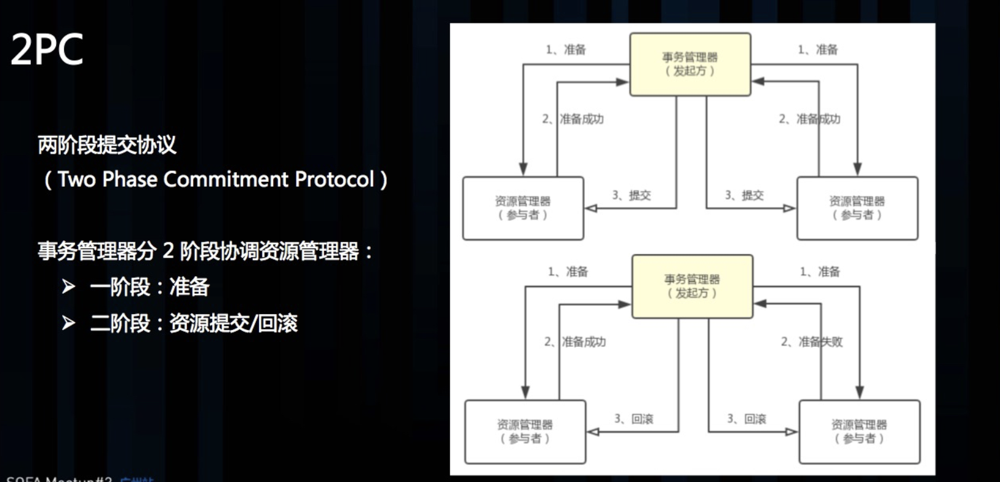
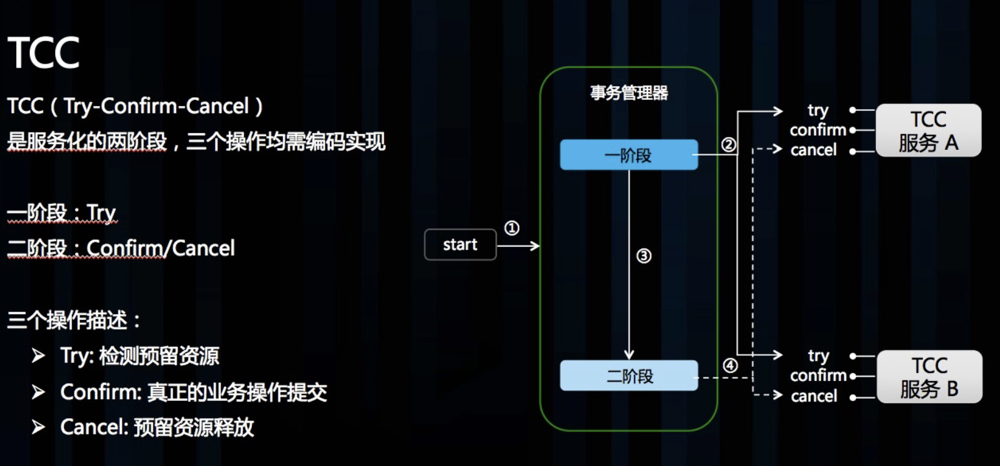
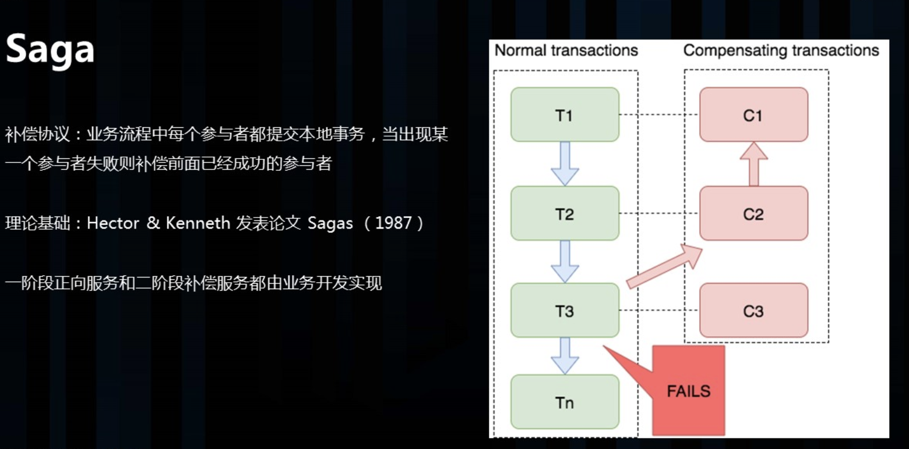
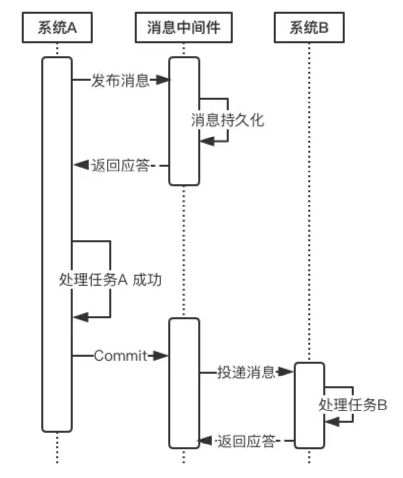

# 什么是分布式事务

随着互联网快速发展，微服务，SOA等服务架构模式正在被大规模的使用，现在分布式系统一般由多个独立的子系统组成，多个子系统通过网络通信互相协作配合完成各个功能。

例如电商网站的下单支付流程，当采用了微服务架构后，一个电商系统往往被拆分成如下几个子系统：商品系统、订单系统、支付系统、积分系统等。整个下单的过程如下：

1. 用户通过商品系统浏览商品，他看中了某一项商品，便点击下单
2. 此时订单系统会生成一条订单
3. 订单创建成功后，支付系统提供支付功能
4. 当支付完成后，由积分系统为该用户增加积分

上述步骤2、3、4需要在一个事务中完成。对于传统单体应用而言，实现事务非常简单，只需将这三个步骤放在一个方法A中，再用Spring的@Transactional注解标识该方法即可。Spring通过数据库的事务支持，保证这些步骤要么全都执行完成，要么全都不执行。但在这个微服务架构中，这三个步骤涉及三个系统，涉及三个数据库，此时我们必须在数据库和应用系统之间，通过某项黑科技，实现分布式事务的支持。

具体一点而言，分布式事务是指事务的参与者、支持事务的服务器、资源服务器以及事务管理器分别位于不同的分布式系统的不同节点之上。

# 分布式事务理论基础

## CAP理论

CAP理论说的是：在一个分布式系统中，最多只能满足C、A、P中的两个需求。

CAP的含义：

- C：Consistency 一致性 同一数据的多个副本是否实时相同。
- A：Availability 可用性 可用性：一定时间内 & 系统返回一个明确的结果 则称为该系统可用。
- P：Partition tolerance 分区容错性 将同一服务分布在多个系统中，从而保证某一个系统宕机，仍然有其他系统提供相同的服务。

## BASE理论

CAP理论告诉我们一个悲惨但不得不接受的事实——我们只能在C、A、P中选择两个条件。而对于业务系统而言，我们往往选择牺牲一致性来换取系统的可用性和分区容错性。不过这里要指出的是，所谓的“牺牲一致性”并不是完全放弃数据一致性，而是牺牲**强一致性**换取**弱一致性**。

- BA：Basic Available 基本可用 
  - 整个系统在某些不可抗力的情况下，仍然能够保证“可用性”，即一定时间内仍然能够返回一个明确的结果。只不过“基本可用”和“高可用”的区别是： 
    - “一定时间”可以适当延长 当举行大促时，响应时间可以适当延长
    - 给部分用户返回一个降级页面 给部分用户直接返回一个降级页面，从而缓解服务器压力。但要注意，返回降级页面仍然是返回明确结果。

- S：Soft State：柔性状态 同一数据的不同副本的状态，可以不需要实时一致。

- E：Eventual Consisstency：最终一致性 同一数据的不同副本的状态，可以不需要实时一致，但一定要保证经过一定时间后仍然是一致的。

## 两阶段提交协议

两阶段提交协议：事务管理器分两个阶段来协调资源管理器，第一阶段准备资源，也就是预留事务所需的资源，如果每个资源管理器都资源预留成功，则进行第二阶段资源提交，否则协调资源管理器回滚资源。

## TCC

TCC（Try-Confirm-Cancel） 实际上是服务化的两阶段提交协议，业务开发者需要实现这三个服务接口，第一阶段服务由业务代码编排来调用 Try 接口进行资源预留，所有参与者的 Try 接口都成功了，事务管理器会提交事务，并调用每个参与者的 Confirm 接口真正提交业务操作，否则调用每个参与者的 Cancel 接口回滚事务。

## Sega

Saga 是一种补偿协议，在 Saga 模式下，分布式事务内有多个参与者，每一个参与者都是一个冲正补偿服务，需要用户根据业务场景实现其正向操作和逆向回滚操作。

分布式事务执行过程中，依次执行各参与者的正向操作，如果所有正向操作均执行成功，那么分布式事务提交。如果任何一个正向操作执行失败，那么分布式事务会退回去执行前面各参与者的逆向回滚操作，回滚已提交的参与者，使分布式事务回到初始状态。

Saga 理论出自 Hector & Kenneth 1987发表的论文 Sagas。

Saga 正向服务与补偿服务也需要业务开发者实现。

# 分布式事务的解决方案

## 基于可靠消息服务的分布式事务

这种实现分布式事务的方式需要通过消息中间件来实现。假设有A和B两个系统，分别可以处理任务A和任务B。此时系统A中存在一个业务流程，需要将任务A和任务B在同一个事务中处理。下面基于消息中间件来实现这种分布式事务。

- 在系统A处理任务A前，首先向消息中间件发送一条消息

- 消息中间件收到后将该条消息持久化，但并不投递。此时下游系统B仍然不知道该条消息的存在。

- 消息中间件持久化成功后，便向系统A返回一个确认应答；

- 系统A收到确认应答后，则可以开始处理任务A；

- 任务A处理完成后，向消息中间件发送Commit请求。该请求发送完成后，对系统A而言，该事务的处理过程就结束了，此时它可以处理别的任务了。 但commit消息可能会在传输途中丢失，从而消息中间件并不会向系统B投递这条消息，从而系统就会出现不一致性。这个问题可由消息中间件的事务回查机制完成。

- 消息中间件收到Commit指令后，便向系统B投递该消息，从而触发任务B的执行；

- 当任务B执行完成后，系统B向消息中间件返回一个确认应答，告诉消息中间件该消息已经成功消费，此时，这个分布式事务完成。

## 分布式事务 Seata 解决方案

Seata 是一款开源的分布式事务解决方案，致力于在微服务架构下提供高性能和简单易用的分布式事务服务。

Seata 会有 4 种分布式事务解决方案，分别是 AT 模式、TCC 模式、Saga 模式和 XA 模式。

- AT模式
  - 依赖全局事务注解和代理数据源，其余代码基本不需要改动，对业务无侵入、接入成本极小
  - 作用范围在于底层数据源，通过保存操作行记录的前后快照和生成反向 SQL 语句进行补偿操作，实现难度较大，优点是对上层应用透明
  - 默认全局隔离级别是 **读未提交（Read Uncommitted）**
  - 如果应用在特定场景下，必需要求全局的 **读已提交** ，目前 Seata 的方式是通过 SELECT FOR UPDATE 语句的代理
  -  需要借助于全局锁和 `GlobalLock` 注解来解决不同全局事务间的写冲突问题，如果一阶段分支事务成功则二阶段一开始全局锁即被释放，否则需要夯住直到分支事务二阶段回滚完成才能释放全局锁
- TCC模式
  - 依赖于用户自行实现的三个方法成本较大
  - 作用范围在应用层，本质上是实现针对某种业务逻辑的正向和反向方法
  - 仅 try 阶段加锁，后续补偿逻辑事务间各自独立

// TODO：待深入了解后完善

# 参考资料

- [常用的分布式事务解决方案](https://juejin.im/post/5aa3c7736fb9a028bb189bca)
- [分布式事务选型的取舍](https://www.infoq.cn/article/8bu33kuSyJ6P-wAAoELT)
- [分布式事务 Seata Saga 模式首秀以及三种模式详解（蚂蚁金服：屹远）](https://www.sofastack.tech/blog/sofa-meetup-3-seata-retrospect/)
- [TCC事务机制简介](http://www.bytesoft.org/tcc-intro/)
- [关于如何实现一个TCC分布式事务框架的一点思考](http://www.bytesoft.org/how-to-impl-tcc/)
- [大规模SOA系统中的分布事务处理（蚂蚁金服CTO：程立）](./assets/大规模SOA系统中的分布事务处理（蚂蚁金服CTO：程立）.pdf)
- [Life beyond Distributed Transactions-an Apostate’s Opinion](./assets/Life%20beyond%20Distributed%20Transactions-%20an%20Apostate’s%20Opinion.pdf)
- [[关于分布式事务、两阶段提交协议、三阶提交协议](http://www.hollischuang.com/archives/681)](http://www.hollischuang.com/archives/681)
- [阿里开源分布式事务解决方案 Fescar 全解析](https://segmentfault.com/a/1190000018057083)
- [理解分布式事务](https://juejin.im/post/5c0e5bf8e51d45063322fe50)
- [分布式服务化系统一致性的“最佳实干”](https://www.jianshu.com/p/1156151e20c8)
- [Seata](https://seata.io/zh-cn/)